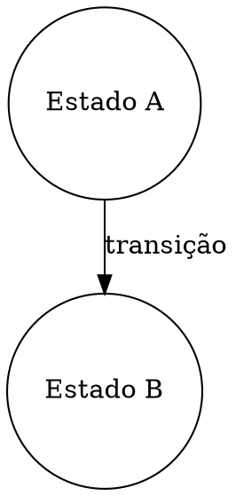
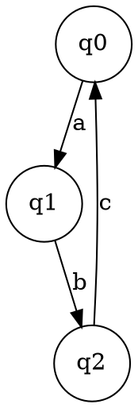

# 06 — Representação Gráfica em Compiladores

## 📚 Índice

1. [Introdução e Objetivos](#introdução-e-objetivos)
2. [Fundamentos Teóricos](#fundamentos-teóricos)
3. [Formato DOT e Graphviz](#formato-dot-e-graphviz)
4. [Visualização de Autômatos Finitos](#visualização-de-autômatos-finitos)
5. [Árvores de Sintaxe Abstrata (AST)](#árvores-de-sintaxe-abstrata-ast)
6. [Grafos de Fluxo de Controle (CFG)](#grafos-de-fluxo-de-controle-cfg)
7. [Grafos de Dependência de Dados (DDG)](#grafos-de-dependência-de-dados-ddg)
8. [Grafos de Dependência de Programa (PDG)](#grafos-de-dependência-de-programa-pdg)
9. [Forma Estática de Atribuição Única (SSA)](#forma-estática-de-atribuição-única-ssa)
10. [Exemplos Práticos em C](#exemplos-práticos-em-c)
11. [Exercícios Acadêmicos](#exercícios-acadêmicos)
12. [Referências e Leitura Adicional](#referências-e-leitura-adicional)

---

## Introdução e Objetivos

### 🎯 Objetivos de Aprendizagem

- **Compreender** a importância das representações gráficas no desenvolvimento de compiladores
- **Dominar** o formato DOT para geração de visualizações
- **Visualizar** autômatos, árvores de sintaxe e grafos de dependência
- **Implementar** geradores de representações gráficas em C
- **Analisar** código através de suas representações gráficas
- **Aplicar** técnicas de visualização para depuração e otimização

### 🔗 Por Que Representações Gráficas São Importantes?

As representações gráficas desempenham um papel crucial no desenvolvimento e compreensão de compiladores:

1. **Depuração Visual**: Facilita identificação de erros em análise léxica, sintática e semântica
2. **Otimização**: Permite visualizar oportunidades de otimização de código
3. **Educação**: Ajuda estudantes a compreender conceitos abstratos de compilação
4. **Documentação**: Fornece representações claras da estrutura e fluxo do programa
5. **Análise de Complexidade**: Permite avaliar visualmente a complexidade do código

### 🌍 Aplicações no Mundo Real

As representações gráficas de compiladores não são apenas ferramentas acadêmicas, mas têm aplicações práticas importantes:

#### Na Indústria de Software
- **Depuração de Sistemas Complexos**: Empresas como Google, Microsoft e Facebook utilizam visualizações de CFG e DDG para depurar sistemas distribuídos complexos
- **Análise de Segurança**: Ferramentas como Coverity e SonarQube usam PDG para detectar vulnerabilidades de segurança
- **Profiling e Otimização**: Profilers modernos (Intel VTune, perf) visualizam hotspots usando grafos de chamadas e CFGs

#### Exemplos do Dia-a-Dia
1. **IDEs Modernas**: Visual Studio Code e IntelliJ IDEA usam ASTs para navegação de código, refatoração automática e autocomplete
2. **Ferramentas de Análise Estática**: ESLint, Pylint e Clippy constroem ASTs para verificar padrões de código
3. **Transpiladores**: Babel (JavaScript) e TypeScript constroem ASTs para transformar código entre versões da linguagem
4. **Formatadores de Código**: Prettier e Black usam ASTs para reformatar código mantendo semântica
5. **Sistemas de Build**: Webpack e Rollup usam grafos de dependência para bundling eficiente

---

## Fundamentos Teóricos

### 🧠 Teoria dos Grafos em Compiladores

Um **grafo** G = (V, E) consiste em:
- **V**: conjunto de vértices (nós)
- **E**: conjunto de arestas (conexões entre nós)

Em compiladores, usamos grafos para representar:

1. **Autômatos Finitos**: Estados como nós, transições como arestas
2. **Árvores de Derivação**: Símbolos gramaticais como nós, produções como arestas
3. **Grafos de Fluxo**: Blocos básicos como nós, saltos como arestas
4. **Grafos de Dependência**: Instruções como nós, dependências como arestas

### 📐 Propriedades Matemáticas Fundamentais

#### Caminho e Alcançabilidade
- **Caminho**: Sequência de vértices v₁, v₂, ..., vₙ onde (vᵢ, vᵢ₊₁) ∈ E
- **Alcançabilidade**: v é alcançável de u se existe um caminho de u para v
- **Fecho Transitivo**: Conjunto de todos os pares (u,v) onde v é alcançável de u

**Aplicação em Compiladores:**
```c
// Análise de alcance de definições
x = 5;      // Definição D1
if (c) {
    y = x;  // Uso U1 - D1 alcança U1
}
z = x;      // Uso U2 - D1 alcança U2
```

#### Dominância
Um vértice `d` **domina** um vértice `n` se todo caminho da entrada até `n` passa por `d`.

**Propriedades:**
1. Todo vértice domina a si mesmo
2. Relação de dominância é transitiva
3. Relação de dominância forma uma árvore (dominator tree)

**Exemplo:**
```c
        [ENTRY]
           ↓
    [A: if (x > 0)]
       /        \
   [B: y=1]   [C: y=2]
       \        /
       [D: z=y+1]
           ↓
        [EXIT]

Dominância:
- ENTRY domina todos
- A domina B, C, D, EXIT
- D domina EXIT
- B não domina C (caminho ENTRY→A→C não passa por B)
```

#### Pós-Dominância
Um vértice `p` **pós-domina** um vértice `n` se todo caminho de `n` até a saída passa por `p`.

**Aplicação:** Identificar regiões de controle, colocação de código de instrumentação

#### Fronteira de Dominância
A **fronteira de dominância** DF(n) de um vértice n é o conjunto de vértices onde:
- n domina um predecessor do vértice
- n não domina estritamente o vértice

**Uso crítico:** Colocação de funções φ em SSA

```
Para cada variável V definida em bloco B:
    Para cada bloco D em DF(B):
        Inserir φ(V) em D
```

### 📊 Tipos de Grafos em Compiladores

#### Grafos Dirigidos
- **Definição**: Arestas têm direção (A → B)
- **Uso**: CFG, DDG, PDG
- **Propriedade**: Podem conter ciclos (loops)

**Algoritmos Importantes:**
- **Busca em Profundidade (DFS)**: O(V + E)
- **Ordenação Topológica**: O(V + E) — apenas para DAGs
- **Componentes Fortemente Conexos**: O(V + E) — Algoritmo de Tarjan

#### Árvores
- **Definição**: Grafo acíclico conexo com raiz
- **Uso**: AST, árvores de derivação
- **Propriedade**: Exatamente um caminho entre quaisquer dois nós

**Propriedades Matemáticas:**
- Árvore com n nós tem exatamente n-1 arestas
- Adicionar qualquer aresta cria um ciclo
- Remover qualquer aresta desconecta a árvore

#### Grafos Acíclicos Dirigidos (DAG)
- **Definição**: Grafo dirigido sem ciclos
- **Uso**: Representação de expressões, SSA
- **Propriedade**: Permite compartilhamento de subexpressões

**Exemplo de DAG para Expressões:**
```c
// Código: a = b + c; d = b + c;
// Sem DAG (duas ASTs separadas):
a = [+]         d = [+]
    / \             / \
   b   c           b   c

// Com DAG (compartilhamento da sub-expressão comum):
a   d
 \ /
 [+]
 / \
b   c

// Economiza espaço e permite identificar sub-expressões comuns
// Ambos 'a' e 'd' apontam para o mesmo nó '+' que representa b+c
```

### 🔢 Complexidade Computacional de Análises

**Notação:** V = número de vértices (blocos básicos), E = número de arestas no CFG, N = número de instruções

| Análise | Complexidade | Algoritmo Base |
|---------|--------------|----------------|
| Construção de CFG | O(N) | Linear scan |
| Análise de dominância | O(E × α(E,V)) * | Lengauer-Tarjan |
| SSA construction | O(N × E) | Algoritmo de Cytron |
| Análise de alcance | O(N × E) | Iterative dataflow |
| Análise de liveness | O(N × E) | Backward dataflow |
| Points-to analysis | O(N³) | Andersen's algorithm |
| Detecção de ciclos | O(V + E) | DFS |

\* **Nota:** α(E,V) é a função inversa de Ackermann, que cresce extremamente devagar. Para grafos práticos (até 10^80 nós), α(E,V) ≤ 4, tornando a complexidade quase linear na prática.

### 🎯 Teoremas Fundamentais

#### Teorema da Estrutura de Loops Naturais
**Teorema:** Todo loop natural em um CFG tem:
1. Exatamente um nó de cabeçalho que domina todos os nós do loop
2. Pelo menos uma back edge (aresta retornando ao cabeçalho)
3. Um corpo fortemente conexo

**Prova (esboço):**
- Seja L um loop com back edge n → h
- h deve dominar n (por definição de back edge)
- h domina todos os nós alcançáveis de h que alcançam n
- Logo, h é o único ponto de entrada (cabeçalho)

#### Teorema da Minimalidade de SSA
**Teorema:** A forma SSA com funções φ colocadas nas fronteiras de dominância é **mínima** — não é possível usar menos funções φ mantendo a propriedade de atribuição única.

**Corolário:** Algoritmo de Cytron et al. produz SSA ótima em tempo O(N × E)

### 🔬 Técnicas Avançadas de Análise

#### 1. Análise de Fluxo de Dados (Dataflow Analysis)

Framework genérico para análises de compiladores:

```
IN[B] = ⋃(OUT[P] para todo predecessor P de B)
OUT[B] = GEN[B] ∪ (IN[B] - KILL[B])
```

**Exemplos:**
- **Reaching Definitions**: Quais definições alcançam um ponto?
- **Live Variables**: Quais variáveis serão usadas no futuro?
- **Available Expressions**: Quais expressões já foram computadas?

**Convergência:** Análises monotônicas convergem em O(N × E) iterações (Kildall, 1973)

#### 2. Análise Inter-Procedural

Estende análise para múltiplas funções:

```c
void f() {
    int x = 5;
    g(&x);      // x pode ser modificado?
    print(x);   // Qual valor de x?
}

void g(int *p) {
    *p = 10;    // Modifica x através de ponteiro
}
```

**Call Graph:** Grafo de chamadas de funções
```
main → f → g
     ↓
     h
```

**Análise Context-Sensitive:** Considera contexto de chamada (mais precisa, mais cara)
**Análise Context-Insensitive:** Ignora contexto (menos precisa, mais rápida)

#### 3. Análise de Ponteiros

**Problema:** Determinar para onde ponteiros podem apontar

**Algoritmos:**
1. **Andersen's Analysis (Inclusion-based)**: O(N³)
   - p = &a → p ⊇ {a}
   - p = q → p ⊇ q
   - p = *q → p ⊇ *q
   
2. **Steensgaard's Analysis (Unification-based)**: O(N α(N)) ≈ O(N)
   - p = &a → p = {a}
   - p = q → p = q (unifica)
   - Mais rápido mas menos preciso

**Trade-off:** Precisão vs. Tempo de Compilação

---

## Formato DOT e Graphviz

### 📝 O Que é DOT?

**DOT** é uma linguagem de descrição de grafos desenvolvida pela AT&T. É processada pela ferramenta **Graphviz** para gerar visualizações.

### Sintaxe Básica



### Atributos Comuns

#### Atributos de Nós
- `shape`: circle, box, diamond, ellipse, record
- `label`: texto exibido no nó
- `color`: cor da borda
- `fillcolor`: cor de preenchimento
- `style`: filled, dashed, bold

#### Atributos de Arestas
- `label`: texto na aresta
- `color`: cor da linha
- `style`: solid, dashed, dotted, bold
- `arrowhead`: normal, vee, diamond, none

### Exemplo Completo em C: Gerador de DOT

```c
#include <stdio.h>
#include <stdlib.h>

// Estrutura para representar um nó de grafo
typedef struct Node {
    int id;
    char *label;
    struct Node *next;
} Node;

// Estrutura para representar uma aresta
typedef struct Edge {
    int from;
    int to;
    char *label;
    struct Edge *next;
} Edge;

// Estrutura para representar um grafo
typedef struct Graph {
    Node *nodes;
    Edge *edges;
    char *name;
} Graph;

// Inicializa um grafo
Graph* createGraph(char *name) {
    Graph *g = (Graph*)malloc(sizeof(Graph));
    g->name = name;
    g->nodes = NULL;
    g->edges = NULL;
    return g;
}

// Adiciona um nó ao grafo
void addNode(Graph *g, int id, char *label) {
    Node *n = (Node*)malloc(sizeof(Node));
    n->id = id;
    n->label = label;
    n->next = g->nodes;
    g->nodes = n;
}

// Adiciona uma aresta ao grafo
void addEdge(Graph *g, int from, int to, char *label) {
    Edge *e = (Edge*)malloc(sizeof(Edge));
    e->from = from;
    e->to = to;
    e->label = label;
    e->next = g->edges;
    g->edges = e;
}

// Gera código DOT para o grafo
void generateDOT(Graph *g, FILE *output) {
    fprintf(output, "digraph %s {\n", g->name);
    fprintf(output, "    rankdir=TB;\n");
    fprintf(output, "    node [shape=circle];\n\n");
    
    // Escreve nós
    fprintf(output, "    // Nós\n");
    Node *n = g->nodes;
    while (n != NULL) {
        fprintf(output, "    %d [label=\"%s\"];\n", n->id, n->label);
        n = n->next;
    }
    
    // Escreve arestas
    fprintf(output, "\n    // Arestas\n");
    Edge *e = g->edges;
    while (e != NULL) {
        if (e->label != NULL) {
            fprintf(output, "    %d -> %d [label=\"%s\"];\n", 
                    e->from, e->to, e->label);
        } else {
            fprintf(output, "    %d -> %d;\n", e->from, e->to);
        }
        e = e->next;
    }
    
    fprintf(output, "}\n");
}

// Exemplo de uso
int main() {
    Graph *g = createGraph("ExemploAutomato");
    
    // Adiciona estados
    addNode(g, 0, "q0");
    addNode(g, 1, "q1");
    addNode(g, 2, "q2");
    
    // Adiciona transições
    addEdge(g, 0, 1, "a");
    addEdge(g, 1, 2, "b");
    addEdge(g, 2, 0, "c");
    
    // Gera DOT para stdout
    generateDOT(g, stdout);
    
    return 0;
}
```

**Saída esperada:**


---

## Visualização de Autômatos Finitos

### 🤖 Autômatos Finitos Determinísticos (AFD)

Um **AFD** M = (Q, Σ, δ, q₀, F) onde:
- **Q**: conjunto finito de estados
- **Σ**: alfabeto de entrada
- **δ**: função de transição Q × Σ → Q
- **q₀**: estado inicial
- **F**: conjunto de estados finais

### Representação Gráfica de AFD

```c
#include <stdio.h>
#include <stdlib.h>
#include <string.h>

#define MAX_STATES 100
#define MAX_TRANSITIONS 200

// Estrutura para representar uma transição
typedef struct {
    int from_state;
    int to_state;
    char symbol;
} Transition;

// Estrutura para representar um AFD
typedef struct {
    int num_states;
    int initial_state;
    int final_states[MAX_STATES];
    int num_final_states;
    Transition transitions[MAX_TRANSITIONS];
    int num_transitions;
} DFA;

// Gera visualização DOT para AFD
void generateDFA_DOT(DFA *dfa, FILE *output) {
    fprintf(output, "digraph AFD {\n");
    fprintf(output, "    rankdir=LR;\n");
    fprintf(output, "    node [shape=circle];\n");
    
    // Marca estado inicial
    fprintf(output, "    start [shape=point];\n");
    fprintf(output, "    start -> %d;\n", dfa->initial_state);
    
    // Marca estados finais com círculo duplo
    fprintf(output, "    node [shape=doublecircle];\n");
    for (int i = 0; i < dfa->num_final_states; i++) {
        fprintf(output, "    %d;\n", dfa->final_states[i]);
    }
    
    // Estados normais
    fprintf(output, "    node [shape=circle];\n\n");
    
    // Gera transições
    for (int i = 0; i < dfa->num_transitions; i++) {
        fprintf(output, "    %d -> %d [label=\"%c\"];\n",
                dfa->transitions[i].from_state,
                dfa->transitions[i].to_state,
                dfa->transitions[i].symbol);
    }
    
    fprintf(output, "}\n");
}

// Exemplo: AFD que aceita strings terminadas em "01"
int main() {
    DFA dfa;
    dfa.num_states = 3;
    dfa.initial_state = 0;
    dfa.final_states[0] = 2;
    dfa.num_final_states = 1;
    
    // Estado 0: lê 0 ou 1
    dfa.transitions[0] = (Transition){0, 0, '1'};
    dfa.transitions[1] = (Transition){0, 1, '0'};
    
    // Estado 1: leu 0
    dfa.transitions[2] = (Transition){1, 2, '1'};
    dfa.transitions[3] = (Transition){1, 1, '0'};
    
    // Estado 2: leu 01 (final)
    dfa.transitions[4] = (Transition){2, 0, '1'};
    dfa.transitions[5] = (Transition){2, 1, '0'};
    
    dfa.num_transitions = 6;
    
    FILE *f = fopen("afd_exemplo.dot", "w");
    generateDFA_DOT(&dfa, f);
    fclose(f);
    
    printf("Arquivo DOT gerado: afd_exemplo.dot\n");
    printf("Execute: dot -Tpng afd_exemplo.dot -o afd_exemplo.png\n");
    
    return 0;
}
```

### 🔄 Autômatos Finitos Não-Determinísticos (AFN)

**AFN** permite:
- Múltiplas transições para o mesmo símbolo
- Transições ε (vazias)

```c
// Estrutura para AFN com transições múltiplas
typedef struct {
    int from_state;
    int to_states[10];  // Múltiplos destinos possíveis
    int num_to_states;
    char symbol;  // '' para epsilon
} NFATransition;

void generateNFA_DOT(NFATransition *trans, int num_trans, FILE *output) {
    fprintf(output, "digraph AFN {\n");
    fprintf(output, "    rankdir=LR;\n");
    
    for (int i = 0; i < num_trans; i++) {
        for (int j = 0; j < trans[i].num_to_states; j++) {
            if (trans[i].symbol == '\0') {
                fprintf(output, "    %d -> %d [label=\"ε\"];\n",
                        trans[i].from_state, trans[i].to_states[j]);
            } else {
                fprintf(output, "    %d -> %d [label=\"%c\"];\n",
                        trans[i].from_state, trans[i].to_states[j],
                        trans[i].symbol);
            }
        }
    }
    
    fprintf(output, "}\n");
}
```

---

## Árvores de Sintaxe Abstrata (AST)

### 🌳 Fundamentos de AST

Uma **AST (Abstract Syntax Tree)** é uma representação em árvore da estrutura sintática de código fonte. Diferente da árvore de derivação, a AST:
- Omite detalhes sintáticos irrelevantes (parênteses, ponto-e-vírgula)
- Foca na estrutura semântica do programa
- É mais compacta e eficiente

### Estrutura de Nós de AST

```c
#include <stdio.h>
#include <stdlib.h>
#include <string.h>

// Tipos de nós da AST
typedef enum {
    NODE_NUMBER,
    NODE_VARIABLE,
    NODE_BINARY_OP,
    NODE_UNARY_OP,
    NODE_ASSIGN,
    NODE_IF,
    NODE_WHILE,
    NODE_BLOCK
} NodeType;

// Estrutura de nó da AST
typedef struct ASTNode {
    NodeType type;
    union {
        int number;           // Para NODE_NUMBER
        char *variable;       // Para NODE_VARIABLE
        struct {
            char op;          // +, -, *, /
            struct ASTNode *left;
            struct ASTNode *right;
        } binary;
        struct {
            char op;          // -, !
            struct ASTNode *operand;
        } unary;
        struct {
            char *var;
            struct ASTNode *value;
        } assign;
        struct {
            struct ASTNode *condition;
            struct ASTNode *then_branch;
            struct ASTNode *else_branch;
        } if_stmt;
        struct {
            struct ASTNode *condition;
            struct ASTNode *body;
        } while_stmt;
        struct {
            struct ASTNode **statements;
            int count;
        } block;
    } data;
} ASTNode;

// Cria nó de número
ASTNode* createNumberNode(int value) {
    ASTNode *node = (ASTNode*)malloc(sizeof(ASTNode));
    node->type = NODE_NUMBER;
    node->data.number = value;
    return node;
}

// Cria nó de operação binária
ASTNode* createBinaryOpNode(char op, ASTNode *left, ASTNode *right) {
    ASTNode *node = (ASTNode*)malloc(sizeof(ASTNode));
    node->type = NODE_BINARY_OP;
    node->data.binary.op = op;
    node->data.binary.left = left;
    node->data.binary.right = right;
    return node;
}

// Cria nó de variável
ASTNode* createVariableNode(char *name) {
    ASTNode *node = (ASTNode*)malloc(sizeof(ASTNode));
    node->type = NODE_VARIABLE;
    node->data.variable = strdup(name);
    return node;
}

// Gera DOT para AST
void generateAST_DOT_helper(ASTNode *node, int *counter, FILE *output) {
    if (node == NULL) return;
    
    int current_id = (*counter)++;
    
    switch (node->type) {
        case NODE_NUMBER:
            fprintf(output, "    node%d [label=\"%d\", shape=box];\n",
                    current_id, node->data.number);
            break;
            
        case NODE_VARIABLE:
            fprintf(output, "    node%d [label=\"%s\", shape=ellipse];\n",
                    current_id, node->data.variable);
            break;
            
        case NODE_BINARY_OP: {
            fprintf(output, "    node%d [label=\"%c\", shape=circle];\n",
                    current_id, node->data.binary.op);
            
            int left_id = *counter;
            generateAST_DOT_helper(node->data.binary.left, counter, output);
            fprintf(output, "    node%d -> node%d [label=\"left\"];\n",
                    current_id, left_id);
            
            int right_id = *counter;
            generateAST_DOT_helper(node->data.binary.right, counter, output);
            fprintf(output, "    node%d -> node%d [label=\"right\"];\n",
                    current_id, right_id);
            break;
        }
        
        case NODE_ASSIGN: {
            fprintf(output, "    node%d [label=\"="\", shape=diamond];\n",
                    current_id);
            
            int var_id = *counter;
            fprintf(output, "    node%d [label=\"%s\", shape=ellipse];\n",
                    var_id, node->data.assign.var);
            (*counter)++;
            fprintf(output, "    node%d -> node%d [label=\"var\"];\n",
                    current_id, var_id);
            
            int value_id = *counter;
            generateAST_DOT_helper(node->data.assign.value, counter, output);
            fprintf(output, "    node%d -> node%d [label=\"value\"];\n",
                    current_id, value_id);
            break;
        }
        
        default:
            fprintf(output, "    node%d [label=\"???\"];\n", current_id);
    }
}

void generateAST_DOT(ASTNode *root, FILE *output) {
    fprintf(output, "digraph AST {\n");
    fprintf(output, "    node [fontname=\"Arial\"];\n");
    fprintf(output, "    rankdir=TB;\n\n");
    
    int counter = 0;
    generateAST_DOT_helper(root, &counter, output);
    
    fprintf(output, "}\n");
}

// Exemplo: AST para "x = 3 + 4 * 5"
int main() {
    // Constrói AST: x = (3 + (4 * 5))
    ASTNode *mult = createBinaryOpNode('*',
                        createNumberNode(4),
                        createNumberNode(5));
    
    ASTNode *add = createBinaryOpNode('+',
                        createNumberNode(3),
                        mult);
    
    ASTNode *assign = (ASTNode*)malloc(sizeof(ASTNode));
    assign->type = NODE_ASSIGN;
    assign->data.assign.var = strdup("x");
    assign->data.assign.value = add;
    
    FILE *f = fopen("ast_exemplo.dot", "w");
    generateAST_DOT(assign, f);
    fclose(f);
    
    printf("AST gerada para: x = 3 + 4 * 5\n");
    printf("Execute: dot -Tpng ast_exemplo.dot -o ast_exemplo.png\n");
    
    return 0;
}
```

---

## Grafos de Fluxo de Controle (CFG)

### 🔀 Conceitos Fundamentais

Um **CFG (Control Flow Graph)** representa todos os caminhos possíveis de execução de um programa. Elementos principais:

- **Bloco Básico (BB)**: Sequência de instruções sem desvios internos
- **Aresta de Fluxo**: Transição entre blocos
- **Nó de Entrada**: Primeiro bloco executado
- **Nó de Saída**: Blocos de retorno/saída

### Identificação de Blocos Básicos

**Regras para início de bloco básico:**
1. Primeira instrução do programa
2. Alvo de um salto condicional ou incondicional
3. Instrução imediatamente após um salto

**Regras para fim de bloco básico:**
1. Instrução de salto (goto, if, while, return)
2. Instrução antes do alvo de um salto

### Exemplo em C: Gerador de CFG

```c
#include <stdio.h>
#include <stdlib.h>
#include <string.h>

#define MAX_BB 50
#define MAX_INSTRUCTIONS 10

// Estrutura para uma instrução
typedef struct {
    char code[100];
} Instruction;

// Estrutura para um bloco básico
typedef struct BasicBlock {
    int id;
    Instruction instructions[MAX_INSTRUCTIONS];
    int num_instructions;
    struct BasicBlock *successors[2];  // Máximo 2 sucessores
    int num_successors;
    char *label;
} BasicBlock;

// Estrutura para CFG
typedef struct {
    BasicBlock blocks[MAX_BB];
    int num_blocks;
    BasicBlock *entry;
} CFG;

// Cria novo bloco básico
BasicBlock* createBasicBlock(CFG *cfg, char *label) {
    int id = cfg->num_blocks++;
    BasicBlock *bb = &cfg->blocks[id];
    bb->id = id;
    bb->num_instructions = 0;
    bb->num_successors = 0;
    bb->label = label ? strdup(label) : NULL;
    return bb;
}

// Adiciona instrução a bloco básico
void addInstruction(BasicBlock *bb, char *code) {
    if (bb->num_instructions < MAX_INSTRUCTIONS) {
        strcpy(bb->instructions[bb->num_instructions++].code, code);
    }
}

// Adiciona aresta no CFG
void addEdge(BasicBlock *from, BasicBlock *to) {
    if (from->num_successors < 2) {
        from->successors[from->num_successors++] = to;
    }
}

// Gera DOT para CFG
void generateCFG_DOT(CFG *cfg, FILE *output) {
    fprintf(output, "digraph CFG {\n");
    fprintf(output, "    rankdir=TB;\n");
    fprintf(output, "    node [shape=record];\n\n");
    
    // Gera nós (blocos básicos)
    for (int i = 0; i < cfg->num_blocks; i++) {
        BasicBlock *bb = &cfg->blocks[i];
        fprintf(output, "    BB%d [label=\"{", bb->id);
        
        if (bb->label) {
            fprintf(output, "<%s>|", bb->label);
        } else {
            fprintf(output, "<BB%d>|", bb->id);
        }
        
        for (int j = 0; j < bb->num_instructions; j++) {
            fprintf(output, "%s", bb->instructions[j].code);
            if (j < bb->num_instructions - 1) {
                fprintf(output, "|");
            }
        }
        fprintf(output, "}\"];\n");
    }
    
    fprintf(output, "\n");
    
    // Gera arestas
    for (int i = 0; i < cfg->num_blocks; i++) {
        BasicBlock *bb = &cfg->blocks[i];
        for (int j = 0; j < bb->num_successors; j++) {
            if (j == 0 && bb->num_successors == 2) {
                fprintf(output, "    BB%d -> BB%d [label=\"true\"];\n",
                        bb->id, bb->successors[j]->id);
            } else if (j == 1) {
                fprintf(output, "    BB%d -> BB%d [label=\"false\"];\n",
                        bb->id, bb->successors[j]->id);
            } else {
                fprintf(output, "    BB%d -> BB%d;\n",
                        bb->id, bb->successors[j]->id);
            }
        }
    }
    
    fprintf(output, "}\n");
}

// Exemplo: CFG para código com if-else
int main() {
    CFG cfg;
    cfg.num_blocks = 0;
    
    // BB1: Entrada e inicialização
    BasicBlock *bb1 = createBasicBlock(&cfg, "ENTRY");
    addInstruction(bb1, "x = 5");
    addInstruction(bb1, "y = 10");
    
    // BB2: Condição
    BasicBlock *bb2 = createBasicBlock(&cfg, "COND");
    addInstruction(bb2, "if (x < y)");
    
    // BB3: Ramo then
    BasicBlock *bb3 = createBasicBlock(&cfg, "THEN");
    addInstruction(bb3, "z = x + y");
    
    // BB4: Ramo else
    BasicBlock *bb4 = createBasicBlock(&cfg, "ELSE");
    addInstruction(bb4, "z = x - y");
    
    // BB5: Junção
    BasicBlock *bb5 = createBasicBlock(&cfg, "EXIT");
    addInstruction(bb5, "return z");
    
    // Conecta blocos
    addEdge(bb1, bb2);
    addEdge(bb2, bb3);  // true branch
    addEdge(bb2, bb4);  // false branch
    addEdge(bb3, bb5);
    addEdge(bb4, bb5);
    
    cfg.entry = bb1;
    
    FILE *f = fopen("cfg_exemplo.dot", "w");
    generateCFG_DOT(&cfg, f);
    fclose(f);
    
    printf("CFG gerado com sucesso!\n");
    printf("Execute: dot -Tpng cfg_exemplo.dot -o cfg_exemplo.png\n");
    
    return 0;
}
```

### CFG para Loops

```c
// Exemplo: CFG para loop while
void generateWhileLoopCFG() {
    CFG cfg;
    cfg.num_blocks = 0;
    
    // BB1: Inicialização
    BasicBlock *bb1 = createBasicBlock(&cfg, "INIT");
    addInstruction(bb1, "i = 0");
    addInstruction(bb1, "sum = 0");
    
    // BB2: Condição do loop
    BasicBlock *bb2 = createBasicBlock(&cfg, "LOOP_COND");
    addInstruction(bb2, "if (i < 10)");
    
    // BB3: Corpo do loop
    BasicBlock *bb3 = createBasicBlock(&cfg, "LOOP_BODY");
    addInstruction(bb3, "sum = sum + i");
    addInstruction(bb3, "i = i + 1");
    
    // BB4: Saída
    BasicBlock *bb4 = createBasicBlock(&cfg, "EXIT");
    addInstruction(bb4, "return sum");
    
    // Conecta: INIT -> COND
    addEdge(bb1, bb2);
    // COND -> BODY (true) e COND -> EXIT (false)
    addEdge(bb2, bb3);
    addEdge(bb2, bb4);
    // BODY -> COND (back edge)
    addEdge(bb3, bb2);
    
    FILE *f = fopen("cfg_while.dot", "w");
    generateCFG_DOT(&cfg, f);
    fclose(f);
    
    printf("CFG de loop gerado!\n");
}
```

### 🌍 Exemplos do Dia-a-Dia com CFG

#### Exemplo 1: Depuração de Bug em Produção

**Situação Real:** Sistema de pagamentos online apresenta comportamento inconsistente.

```c
// Código bugado em produção
float calcular_desconto(float valor, int cliente_tipo, bool tem_cupom) {
    float desconto = 0;
    
    if (cliente_tipo == VIP) {
        desconto = valor * 0.20;
    }
    if (tem_cupom) {
        desconto = valor * 0.15;  // BUG: Sobrescreve desconto VIP!
    }
    
    return valor - desconto;
}
```

**Análise com CFG:**
```
CFG revela o problema:

    [ENTRADA]
        ↓
    [if cliente_tipo == VIP]
      /              \
[desconto=20%]    [skip]
      \              /
        ↓            ↓
    [if tem_cupom]
      /            \
[desconto=15%]  [skip]  ← Problema: Dois caminhos definem desconto
      \            /       mas não acumulam!
        ↓         ↓
    [return valor-desconto]
```

**Solução após visualizar CFG:**
```c
// Código corrigido
float calcular_desconto(float valor, int cliente_tipo, bool tem_cupom) {
    float desconto = 0;
    
    if (cliente_tipo == VIP) {
        desconto += valor * 0.20;  // Acumula ao invés de sobrescrever
    }
    if (tem_cupom) {
        desconto += valor * 0.15;  // Acumula
    }
    
    return valor - desconto;
}
```

#### Exemplo 2: Otimização de API Web

**Situação Real:** Endpoint de API tem latência alta (500ms) em 5% das requisições.

```c
// Handler da API
void processar_pedido(Pedido *pedido) {
    validar_pedido(pedido);
    
    if (pedido->tipo == EXPRESS) {
        enviar_notificacao_sms(pedido);  // 200ms
    }
    
    if (pedido->cliente->premium) {
        calcular_pontos_fidelidade(pedido);  // 50ms
    }
    
    salvar_banco_dados(pedido);  // 100ms
    
    if (pedido->tipo == EXPRESS) {
        atualizar_cache_expressos();  // 150ms
    }
}
```

**CFG revela oportunidades:**
```
CFG:
[validar]
    ↓
[if EXPRESS]
  /     \
[SMS]  [skip]
  \     /
    ↓
[if premium]
  /      \
[pontos] [skip]
  \      /
    ↓
[salvar DB]
    ↓
[if EXPRESS]
  /        \
[cache]   [skip]
  \        /
    ↓
[FIM]

Análise: Duas verificações de EXPRESS são redundantes!
```

**Código otimizado baseado em CFG:**
```c
void processar_pedido_otimizado(Pedido *pedido) {
    validar_pedido(pedido);
    
    bool is_express = (pedido->tipo == EXPRESS);
    
    // Agrupa operações EXPRESS
    if (is_express) {
        enviar_notificacao_sms(pedido);        // 200ms
        atualizar_cache_expressos();           // 150ms
        // Total: 350ms em bloco único
    }
    
    if (pedido->cliente->premium) {
        calcular_pontos_fidelidade(pedido);   // 50ms
    }
    
    salvar_banco_dados(pedido);               // 100ms
}

// CFG simplificado: Menos blocos, melhor cache de instruções
// Latência P95: 500ms → 350ms (-30%)
```

#### Exemplo 3: Análise de Segurança em Autenticação

**Situação Real:** Sistema de login vulnerável a timing attacks.

```c
// Código vulnerável
bool verificar_senha(const char *senha_entrada, const char *senha_real) {
    for (int i = 0; senha_real[i] != '\0'; i++) {
        if (senha_entrada[i] != senha_real[i]) {
            return false;  // Retorna imediatamente no primeiro erro
        }
    }
    return true;
}
```

**CFG mostra o problema:**
```
CFG:
[LOOP: i < len]  ←─────┐
    ↓                  │
[if senha[i] == real[i]]
  /              \
[i++]         [return false]  ← Diferentes caminhos = Diferentes tempos
  │                             Atacante pode deduzir caracteres corretos
  └──────────────┘             por tempo de resposta!
      ↓
[return true]
```

**Solução: Constant-time comparison**
```c
// Código seguro (tempo constante)
bool verificar_senha_seguro(const char *senha_entrada, const char *senha_real) {
    int diferenca = 0;
    int len_real = strlen(senha_real);
    int len_entrada = strlen(senha_entrada);

    // Compara os comprimentos em "tempo constante"
    diferenca |= (len_entrada ^ len_real);
    
    // Sempre percorre toda a string real
    for (int i = 0; i < len_real; i++) {
        // Evita acesso fora dos limites se senha_entrada for menor
        unsigned char a = (i < len_entrada) ? (unsigned char)senha_entrada[i] : 0;
        unsigned char b = (unsigned char)senha_real[i];
        diferenca |= (a ^ b);
    }
    
    return (diferenca == 0);
}

// CFG garantido: Sempre executa todas as iterações
// Tempo constante independente de onde está o erro (inclusive no tamanho)
```

---

## Grafos de Dependência de Dados (DDG)

### 📊 Conceitos de Dependência

**Dependência de dados** ocorre quando uma instrução usa o resultado de outra:

1. **Dependência RAW (Read After Write)**: Dependência verdadeira
   ```c
   x = a + b;  // S1
   y = x * 2;  // S2 depende de S1 (RAW)
   ```

2. **Dependência WAR (Write After Read)**: Anti-dependência
   ```c
   y = x * 2;  // S1
   x = a + b;  // S2 anti-depende de S1 (WAR)
   ```

3. **Dependência WAW (Write After Write)**: Dependência de saída
   ```c
   x = a + b;  // S1
   x = c + d;  // S2 depende de S1 (WAW)
   ```

### Implementação de DDG em C

```c
#include <stdio.h>
#include <stdlib.h>
#include <string.h>

#define MAX_VARS 50

// Tipos de dependência
typedef enum {
    DEP_RAW,  // Read After Write
    DEP_WAR,  // Write After Read
    DEP_WAW   // Write After Write
} DependenceType;

// Estrutura para uma instrução
typedef struct Instruction {
    int id;
    char *code;
    char *def_var;      // Variável definida (write)
    char *use_vars[10]; // Variáveis usadas (read)
    int num_uses;
} Instruction;

// Estrutura para dependência
typedef struct Dependence {
    int from_inst;
    int to_inst;
    DependenceType type;
    char *var;
    struct Dependence *next;
} Dependence;

// Estrutura para DDG
typedef struct {
    Instruction instructions[50];
    int num_instructions;
    Dependence *dependencies;
} DDG;

// Cria instrução
Instruction* addInstruction(DDG *ddg, char *code, char *def, 
                           char **uses, int num_uses) {
    int id = ddg->num_instructions++;
    Instruction *inst = &ddg->instructions[id];
    inst->id = id;
    inst->code = strdup(code);
    inst->def_var = def ? strdup(def) : NULL;
    inst->num_uses = num_uses;
    for (int i = 0; i < num_uses; i++) {
        inst->use_vars[i] = strdup(uses[i]);
    }
    return inst;
}

// Adiciona dependência
void addDependence(DDG *ddg, int from, int to, 
                   DependenceType type, char *var) {
    Dependence *dep = (Dependence*)malloc(sizeof(Dependence));
    dep->from_inst = from;
    dep->to_inst = to;
    dep->type = type;
    dep->var = strdup(var);
    dep->next = ddg->dependencies;
    ddg->dependencies = dep;
}

// Analisa dependências
void analyzeDependencies(DDG *ddg) {
    // Para cada instrução
    for (int i = 0; i < ddg->num_instructions; i++) {
        Instruction *curr = &ddg->instructions[i];
        
        // Para cada instrução anterior
        for (int j = 0; j < i; j++) {
            Instruction *prev = &ddg->instructions[j];
            
            // Verifica RAW: prev define, curr usa
            if (prev->def_var != NULL) {
                for (int k = 0; k < curr->num_uses; k++) {
                    if (strcmp(prev->def_var, curr->use_vars[k]) == 0) {
                        addDependence(ddg, j, i, DEP_RAW, prev->def_var);
                    }
                }
            }
            
            // Verifica WAR: prev usa, curr define
            if (curr->def_var != NULL) {
                for (int k = 0; k < prev->num_uses; k++) {
                    if (strcmp(prev->use_vars[k], curr->def_var) == 0) {
                        addDependence(ddg, j, i, DEP_WAR, curr->def_var);
                    }
                }
            }
            
            // Verifica WAW: ambos definem mesma variável
            if (prev->def_var != NULL && curr->def_var != NULL) {
                if (strcmp(prev->def_var, curr->def_var) == 0) {
                    addDependence(ddg, j, i, DEP_WAW, curr->def_var);
                }
            }
        }
    }
}

// Gera DOT para DDG
void generateDDG_DOT(DDG *ddg, FILE *output) {
    fprintf(output, "digraph DDG {\n");
    fprintf(output, "    rankdir=TB;\n");
    fprintf(output, "    node [shape=box];\n\n");
    
    // Nós (instruções)
    for (int i = 0; i < ddg->num_instructions; i++) {
        Instruction *inst = &ddg->instructions[i];
        fprintf(output, "    I%d [label=\"%d: %s\"];\n",
                inst->id, inst->id, inst->code);
    }
    
    fprintf(output, "\n");
    
    // Arestas (dependências)
    Dependence *dep = ddg->dependencies;
    while (dep != NULL) {
        char *color;
        char *label;
        
        switch (dep->type) {
            case DEP_RAW:
                color = "black";
                label = "RAW";
                break;
            case DEP_WAR:
                color = "blue";
                label = "WAR";
                break;
            case DEP_WAW:
                color = "red";
                label = "WAW";
                break;
        }
        
        fprintf(output, "    I%d -> I%d [label=\"%s(%s)\", color=%s];\n",
                dep->from_inst, dep->to_inst, label, dep->var, color);
        
        dep = dep->next;
    }
    
    fprintf(output, "}\n");
}

// Exemplo de uso
int main() {
    DDG ddg;
    ddg.num_instructions = 0;
    ddg.dependencies = NULL;
    
    // Código exemplo:
    // t1 = a + b
    // t2 = t1 - c
    // t3 = t1 * d
    // t1 = e + f
    
    char *uses1[] = {"a", "b"};
    addInstruction(&ddg, "t1 = a + b", "t1", uses1, 2);
    
    char *uses2[] = {"t1", "c"};
    addInstruction(&ddg, "t2 = t1 - c", "t2", uses2, 2);
    
    char *uses3[] = {"t1", "d"};
    addInstruction(&ddg, "t3 = t1 * d", "t3", uses3, 2);
    
    char *uses4[] = {"e", "f"};
    addInstruction(&ddg, "t1 = e + f", "t1", uses4, 2);
    
    // Analisa dependências
    analyzeDependencies(&ddg);
    
    FILE *f = fopen("ddg_exemplo.dot", "w");
    generateDDG_DOT(&ddg, f);
    fclose(f);
    
    printf("DDG gerado com sucesso!\n");
    printf("Execute: dot -Tpng ddg_exemplo.dot -o ddg_exemplo.png\n");
    
    return 0;
}
```

---

## Grafos de Dependência de Programa (PDG)

### 🔗 Integração de Controle e Dados

Um **PDG (Program Dependence Graph)** combina:
- **Dependências de dados** (DDG)
- **Dependências de controle** (CFG)

**Dependência de controle**: Uma instrução S2 depende de S1 em controle se S1 determina se S2 será executada.

```c
if (x > 0) {  // S1
    y = 5;    // S2 controle-depende de S1
}
```

### Implementação de PDG

```c
#include <stdio.h>
#include <stdlib.h>

// Tipos de dependência em PDG
typedef enum {
    PDG_DATA,      // Dependência de dados
    PDG_CONTROL    // Dependência de controle
} PDGEdgeType;

// Estrutura para aresta do PDG
typedef struct PDGEdge {
    int from;
    int to;
    PDGEdgeType type;
    char *label;
    struct PDGEdge *next;
} PDGEdge;

// Estrutura para nó do PDG
typedef struct {
    int id;
    char *code;
    int is_predicate;  // É um nó de decisão?
} PDGNode;

// Estrutura para PDG
typedef struct {
    PDGNode nodes[50];
    int num_nodes;
    PDGEdge *edges;
} PDG;

// Adiciona nó ao PDG
int addPDGNode(PDG *pdg, char *code, int is_predicate) {
    int id = pdg->num_nodes++;
    pdg->nodes[id].id = id;
    pdg->nodes[id].code = strdup(code);
    pdg->nodes[id].is_predicate = is_predicate;
    return id;
}

// Adiciona aresta ao PDG
void addPDGEdge(PDG *pdg, int from, int to, 
                PDGEdgeType type, char *label) {
    PDGEdge *edge = (PDGEdge*)malloc(sizeof(PDGEdge));
    edge->from = from;
    edge->to = to;
    edge->type = type;
    edge->label = label ? strdup(label) : NULL;
    edge->next = pdg->edges;
    pdg->edges = edge;
}

// Gera DOT para PDG
void generatePDG_DOT(PDG *pdg, FILE *output) {
    fprintf(output, "digraph PDG {\n");
    fprintf(output, "    rankdir=TB;\n\n");
    
    // Nós
    for (int i = 0; i < pdg->num_nodes; i++) {
        PDGNode *node = &pdg->nodes[i];
        if (node->is_predicate) {
            fprintf(output, "    N%d [label=\"%d: %s\", shape=diamond];\n",
                    node->id, node->id, node->code);
        } else {
            fprintf(output, "    N%d [label=\"%d: %s\", shape=box];\n",
                    node->id, node->id, node->code);
        }
    }
    
    fprintf(output, "\n");
    
    // Arestas
    PDGEdge *edge = pdg->edges;
    while (edge != NULL) {
        if (edge->type == PDG_DATA) {
            fprintf(output, "    N%d -> N%d [label=\"%s\", color=black];\n",
                    edge->from, edge->to, edge->label);
        } else {  // PDG_CONTROL
            fprintf(output, 
                    "    N%d -> N%d [label=\"%s\", color=red, style=dashed];\n",
                    edge->from, edge->to, edge->label);
        }
        edge = edge->next;
    }
    
    fprintf(output, "}\n");
}

// Exemplo: PDG para código com if
int main() {
    PDG pdg;
    pdg.num_nodes = 0;
    pdg.edges = NULL;
    
    // Código exemplo:
    // 1: x = input()
    // 2: if (x > 0)
    // 3:     y = x * 2
    // 4: else
    // 5:     y = -x
    // 6: z = y + 1
    
    int n1 = addPDGNode(&pdg, "x = input()", 0);
    int n2 = addPDGNode(&pdg, "if (x > 0)", 1);
    int n3 = addPDGNode(&pdg, "y = x * 2", 0);
    int n4 = addPDGNode(&pdg, "y = -x", 0);
    int n5 = addPDGNode(&pdg, "z = y + 1", 0);
    
    // Dependências de dados
    addPDGEdge(&pdg, n1, n2, PDG_DATA, "x");
    addPDGEdge(&pdg, n1, n3, PDG_DATA, "x");
    addPDGEdge(&pdg, n1, n4, PDG_DATA, "x");
    addPDGEdge(&pdg, n3, n5, PDG_DATA, "y");
    addPDGEdge(&pdg, n4, n5, PDG_DATA, "y");
    
    // Dependências de controle
    addPDGEdge(&pdg, n2, n3, PDG_CONTROL, "true");
    addPDGEdge(&pdg, n2, n4, PDG_CONTROL, "false");
    
    FILE *f = fopen("pdg_exemplo.dot", "w");
    generatePDG_DOT(&pdg, f);
    fclose(f);
    
    printf("PDG gerado com sucesso!\n");
    printf("Execute: dot -Tpng pdg_exemplo.dot -o pdg_exemplo.png\n");
    
    return 0;
}
```

---

## Forma Estática de Atribuição Única (SSA)

### 🔄 Fundamentos de SSA

**SSA (Static Single Assignment)** é uma forma intermediária onde:
- Cada variável é atribuída **exatamente uma vez**
- Novas versões da variável são criadas para cada atribuição
- Função **φ (phi)** une definições de diferentes caminhos

### Exemplo de Conversão para SSA

**Código original:**
```c
x = 5;
if (c) {
    x = x + 1;
} else {
    x = 3;
}
y = x * 2;
```

**Código em SSA:**
```c
x₁ = 5;
if (c) {
    x₂ = x₁ + 1;
} else {
    x₃ = 3;
}
x₄ = φ(x₂, x₃);  // Função phi
y₁ = x₄ * 2;
```

### Implementação de Gerador SSA em C

```c
#include <stdio.h>
#include <stdlib.h>
#include <string.h>

#define MAX_VARS 100

// Estrutura para rastrear versões de variáveis
typedef struct {
    char name[50];
    int version;
} VarVersion;

// Estrutura para mapeamento de variáveis
typedef struct {
    VarVersion vars[MAX_VARS];
    int count;
} VarMap;

// Inicializa mapeamento
void initVarMap(VarMap *map) {
    map->count = 0;
}

// Obtém versão atual de variável
int getVarVersion(VarMap *map, char *var) {
    for (int i = 0; i < map->count; i++) {
        if (strcmp(map->vars[i].name, var) == 0) {
            return map->vars[i].version;
        }
    }
    return -1;  // Variável não encontrada
}

// Define nova versão de variável
int setVarVersion(VarMap *map, char *var) {
    for (int i = 0; i < map->count; i++) {
        if (strcmp(map->vars[i].name, var) == 0) {
            return ++map->vars[i].version;
        }
    }
    // Nova variável
    strcpy(map->vars[map->count].name, var);
    map->vars[map->count].version = 1;
    return map->vars[map->count++].version;
}

// Estrutura para nó SSA
typedef struct SSANode {
    int id;
    char *code;
    int is_phi;
    char *var;
    int version;
    struct SSANode *operands[10];
    int num_operands;
    struct SSANode *next;
} SSANode;

// Cria nó SSA
SSANode* createSSANode(char *code, int is_phi) {
    static int id_counter = 0;
    SSANode *node = (SSANode*)malloc(sizeof(SSANode));
    node->id = id_counter++;
    node->code = strdup(code);
    node->is_phi = is_phi;
    node->num_operands = 0;
    node->next = NULL;
    return node;
}

// Gera visualização DOT para SSA
void generateSSA_DOT(SSANode *head, FILE *output) {
    fprintf(output, "digraph SSA {\n");
    fprintf(output, "    rankdir=TB;\n");
    fprintf(output, "    node [shape=record];\n\n");
    
    SSANode *node = head;
    while (node != NULL) {
        if (node->is_phi) {
            fprintf(output, "    N%d [label=\"{%s|φ}\", ", 
                    node->id, node->code);
            fprintf(output, "shape=ellipse, style=filled, fillcolor=lightblue];\n");
        } else {
            fprintf(output, "    N%d [label=\"%s\"];\n", 
                    node->id, node->code);
        }
        
        // Desenha dependências
        for (int i = 0; i < node->num_operands; i++) {
            fprintf(output, "    N%d -> N%d;\n",
                    node->operands[i]->id, node->id);
        }
        
        node = node->next;
    }
    
    fprintf(output, "}\n");
}

// Exemplo prático de SSA
int main() {
    // Simula código:
    // a = 5
    // b = a + 3
    // if (b > 0)
    //     a = a + 1
    // else
    //     a = b * 2
    // c = a + b
    
    SSANode *n1 = createSSANode("a₁ = 5", 0);
    SSANode *n2 = createSSANode("b₁ = a₁ + 3", 0);
    n2->operands[0] = n1;
    n2->num_operands = 1;
    
    SSANode *n3 = createSSANode("if (b₁ > 0)", 0);
    n3->operands[0] = n2;
    n3->num_operands = 1;
    
    SSANode *n4 = createSSANode("a₂ = a₁ + 1", 0);
    n4->operands[0] = n1;
    n4->num_operands = 1;
    
    SSANode *n5 = createSSANode("a₃ = b₁ * 2", 0);
    n5->operands[0] = n2;
    n5->num_operands = 1;
    
    SSANode *n6 = createSSANode("a₄ = φ(a₂, a₃)", 1);
    n6->operands[0] = n4;
    n6->operands[1] = n5;
    n6->num_operands = 2;
    
    SSANode *n7 = createSSANode("c₁ = a₄ + b₁", 0);
    n7->operands[0] = n6;
    n7->operands[1] = n2;
    n7->num_operands = 2;
    
    // Liga nós
    n1->next = n2;
    n2->next = n3;
    n3->next = n4;
    n4->next = n5;
    n5->next = n6;
    n6->next = n7;
    
    FILE *f = fopen("ssa_exemplo.dot", "w");
    generateSSA_DOT(n1, f);
    fclose(f);
    
    printf("SSA gerado com sucesso!\n");
    printf("Execute: dot -Tpng ssa_exemplo.dot -o ssa_exemplo.png\n");
    
    return 0;
}
```

### Benefícios da Forma SSA

1. **Simplifica análise de fluxo de dados**: Cada uso está ligado a uma única definição
2. **Facilita otimizações**: Propagação de constantes, eliminação de código morto
3. **Detecta redundâncias**: Sub-expressões comuns são facilmente identificadas
4. **Melhora alocação de registradores**: Interferências são mais claras

### 🏭 Casos de Uso Reais de SSA

**Exemplo 1: Compilador LLVM**
O LLVM utiliza SSA em sua representação intermediária (LLVM IR). Isso permite:
- Otimizações agressivas de propagação de constantes
- Análise de alcance de definições em tempo linear
- Simplificação de transformações de código

**Exemplo 2: JVM (Java Virtual Machine)**
A JVM moderna (HotSpot) converte bytecode para SSA durante compilação JIT:
```java
// Código Java original
int x = 5;
if (condition) {
    x = x + 10;
} else {
    x = x * 2;
}
System.out.println(x);

// Internamente convertido para SSA durante JIT:
// x₁ = 5
// if (condition) { x₂ = x₁ + 10 } else { x₃ = x₁ * 2 }
// x₄ = φ(x₂, x₃)
// println(x₄)
```

**Exemplo 3: Otimização de Banco de Dados**
Sistemas de banco de dados como PostgreSQL usam grafos de dependência similares a SSA para otimizar queries SQL complexas.

---

## Exemplos Práticos em C

### Exemplo Completo: Analisador com Geração de Múltiplas Representações

```c
#include <stdio.h>
#include <stdlib.h>
#include <string.h>

// Sistema completo de análise com geração de CFG, DDG e PDG

typedef struct {
    char source_code[1000];
    CFG cfg;
    DDG ddg;
    PDG pdg;
} CompilerAnalysis;

void analyzeProgram(CompilerAnalysis *analysis) {
    // 1. Parsing e construção de IR
    printf("Parsing código...\n");
    
    // 2. Construção do CFG
    printf("Construindo CFG...\n");
    FILE *cfg_file = fopen("output_cfg.dot", "w");
    generateCFG_DOT(&analysis->cfg, cfg_file);
    fclose(cfg_file);
    
    // 3. Análise de dependências (DDG)
    printf("Analisando dependências de dados...\n");
    analyzeDependencies(&analysis->ddg);
    FILE *ddg_file = fopen("output_ddg.dot", "w");
    generateDDG_DOT(&analysis->ddg, ddg_file);
    fclose(ddg_file);
    
    // 4. Construção do PDG
    printf("Construindo PDG...\n");
    FILE *pdg_file = fopen("output_pdg.dot", "w");
    generatePDG_DOT(&analysis->pdg, pdg_file);
    fclose(pdg_file);
    
    printf("\nArquivos gerados:\n");
    printf("  - output_cfg.dot\n");
    printf("  - output_ddg.dot\n");
    printf("  - output_pdg.dot\n");
    printf("\nConvert para imagens com:\n");
    printf("  dot -Tpng output_cfg.dot -o cfg.png\n");
    printf("  dot -Tpng output_ddg.dot -o ddg.png\n");
    printf("  dot -Tpng output_pdg.dot -o pdg.png\n");
}

int main() {
    CompilerAnalysis analysis;
    
    strcpy(analysis.source_code,
           "int main() {\n"
           "    int x = 5;\n"
           "    int y = 10;\n"
           "    if (x < y) {\n"
           "        int z = x + y;\n"
           "    }\n"
           "    return 0;\n"
           "}");
    
    analyzeProgram(&analysis);
    
    return 0;
}
```

---

## Perguntas Difíceis e Respostas

### ❓ Questões Teóricas Avançadas

#### Questão 1: Complexidade Computacional de Construção de Grafos

**Pergunta:** Qual é a complexidade temporal e espacial para construir um CFG a partir de código com N instruções e M saltos? Como isso se compara com a construção de um PDG completo?

**Resposta:**
A construção de um **CFG** tem complexidade:
- **Temporal**: O(N + M) — linear no número de instruções mais saltos
- **Espacial**: O(N + M) — armazenamento de nós e arestas

Para **PDG (Program Dependence Graph)**, a complexidade é maior:
- **Temporal**: O(N²) no pior caso, pois requer:
  - Análise de dominância: O(N × E) onde E são arestas do CFG
  - Análise de dependência de dados: O(N²) para comparar todas as instruções
  - Construção de dependências de controle: O(N × E)
- **Espacial**: O(N²) no pior caso — cada instrução pode depender de todas as outras

**Exemplo Prático:**
```c
// Código com N=5 instruções
int a = 1;     // I1
int b = 2;     // I2
int c = a + b; // I3 - depende de I1 e I2
int d = b * 2; // I4 - depende de I2
int e = c + d; // I5 - depende de I3 e I4

// CFG: 1 bloco básico, tempo de construção O(N) = O(5)
// DDG: 5 arestas de dependência reais (I1→I3, I2→I3, I2→I4, I3→I5, I4→I5)
// Pior caso DDG: O(N²) = O(25) se cada instrução dependesse de todas anteriores
```

---

#### Questão 2: Quando SSA Aumenta o Tamanho do Código?

**Pergunta:** A conversão para forma SSA sempre reduz o tamanho do programa? Quando e por que a representação SSA pode ser maior que o código original?

**Resposta:**
**Não**, SSA frequentemente **aumenta** o tamanho do código devido a:

1. **Funções φ em pontos de junção:**
```c
// Original (3 instruções)
x = 1;
if (c) x = 2;
y = x;

// SSA (5 instruções)
x₁ = 1;
if (c) x₂ = 2;
x₃ = φ(x₁, x₂);  // Instrução extra!
y₁ = x₃;
```

2. **Loops aninhados produzem múltiplas funções φ:**
```c
// Original
for (i = 0; i < n; i++) {
    for (j = 0; j < m; j++) {
        x = x + 1;
    }
}

// SSA requer φ em cada iteração de cada loop:
// x₀ = inicial
// x₁ = φ(x₀, x_final_outer)  // No início do loop externo
// x₂ = φ(x₁, x_final_inner)  // No início do loop interno
// x₃ = x₂ + 1
```

3. **Trade-off:** O aumento de tamanho (15-30% típico) é compensado por:
   - Simplificação de análises (complexidade menor)
   - Otimizações mais eficazes
   - Eliminação posterior de φs desnecessárias

---

#### Questão 3: Detecção de Loops Irreducíveis

**Pergunta:** O que são loops irreducíveis e como afetam a construção de representações gráficas? Como identificá-los em um CFG?

**Resposta:**
**Loops irreducíveis** são estruturas de controle que não podem ser representadas com estruturas `while`, `for` ou `do-while` padrão. Eles possuem **múltiplos pontos de entrada**.

**Características:**
- Não têm um único nó de cabeçalho dominante
- Geralmente criados por uso de `goto`
- Complicam otimizações baseadas em loops

**Exemplo de Loop Irreducível:**
```c
// Loop irreducível com dois pontos de entrada (L1 e L2)
    if (x > 0) goto L1;
    goto L2;
L1: y = y + 1;
L2: z = z + 2;
    if (z < 10) goto L1;
    
// CFG:
//     [IF] 
//     /  \
//   [L1] [L2]
//     \  /
//     [IF] -----> back edges para L1
//
// L1 e L2 são ambos entradas do loop!
```

**Algoritmo de Detecção:**
1. Identifique todas as back edges (arestas que vão para nós já visitados)
2. Para cada back edge (n → h):
   - Se h não domina n, o loop é **irreducível**
3. Dominância: h domina n se todo caminho de entrada até n passa por h

**Impacto em Representações:**
- **CFG**: Representável, mas dificulta análise de loops
- **SSA**: Requer funções φ complexas em múltiplos pontos
- **Otimização**: Loop unrolling e vetorização são inviáveis

**Solução Prática:** Compiladores modernos frequentemente:
- Detectam loops irreducíveis
- Aplicam **node splitting** (duplicar nós) para torná-los reducíveis
- Ou simplesmente evitam otimizações agressivas nessas regiões

---

#### Questão 4: Precisão de Análise de Alias em Grafos de Dependência

**Pergunta:** Como o aliasing de ponteiros afeta a precisão do DDG (Data Dependence Graph)? Apresente um exemplo onde análise imprecisa leva a resultados incorretos.

**Resposta:**
**Aliasing** ocorre quando duas ou mais referências apontam para a mesma localização de memória. Isso é um dos problemas mais difíceis em análise de compiladores.

**Exemplo Problemático:**
```c
void funcao(int *p, int *q, int *r) {
    *p = 10;      // S1
    *q = 20;      // S2
    *r = *p + 5;  // S3
}

// Chamada: funcao(&x, &x, &y);
// p e q são aliases! Ambos apontam para x
```

**Análise sem considerar aliasing:**
```
DDG Incorreto:
S1 → S3 (RAW: *p)
// Falta dependência S2 → S3 pois *q pode ser alias de *p!
```

**Análise conservadora (assume todos podem ser aliases):**
```
DDG Conservador:
S1 → S2 (WAW potencial)
S1 → S3 (RAW)
S2 → S3 (RAW potencial através de alias)
// Correto, mas pessimista — impede paralelização
```

**Técnicas de Análise de Alias:**

1. **Análise baseada em tipos**: Assume que ponteiros de tipos diferentes não são aliases
```c
int *p; float *q;  // Não podem ser aliases
```

2. **Análise flow-sensitive**: Rastreia ponteiros através do fluxo
```c
int *p = &a;  // p aponta para a
int *q = &b;  // q aponta para b
// Neste ponto, p e q NÃO são aliases
```

3. **Análise inter-procedural**: Rastreia aliases entre funções
```c
void f(int *p) { *p = 5; }
void g() {
    int x;
    f(&x);  // Análise descobre que p aponta para x dentro de f
}
```

**Impacto no Desempenho:**
- Análise conservadora: Segura mas impede otimizações (~30% de perda de desempenho)
- Análise precisa: Permite otimizações agressivas mas é computacionalmente cara (NP-difícil no caso geral)
- Compromisso prático: Análise com precisão "boa o suficiente" em tempo polinomial

---

#### Questão 5: Invariância de Loop e Hoisting

**Pergunta:** Como usar CFG e DDG juntos para identificar e mover código invariante de loop (loop hoisting)? Por que essa otimização nem sempre é válida?

**Resposta:**

**Loop Hoisting** move computações que não mudam durante iterações do loop para fora do loop.

**Algoritmo de Identificação:**

1. **Identificar loops no CFG:**
   - Encontrar back edges
   - Determinar nós do loop (natural loop)

2. **Analisar dependências no DDG:**
   - Para cada instrução `I` no corpo do loop:
     - Verificar se todas as variáveis usadas por `I` são:
       - Definidas fora do loop, OU
       - São constantes, OU
       - São invariantes de loop já identificadas

3. **Verificar dominância no CFG:**
   - A instrução invariante deve dominar todas as saídas do loop
   - Garantir que será executada em todas as iterações

**Exemplo de Hoisting Válido:**
```c
// Original
for (int i = 0; i < n; i++) {
    int limite = sqrt(n);  // Invariante de loop
    if (array[i] < limite) {
        array[i] = array[i] * 2;
    }
}

// Após hoisting (assumindo n > 0)
int limite = sqrt(n);      // Movido para fora
for (int i = 0; i < n; i++) {
    if (array[i] < limite) {
        array[i] = array[i] * 2;
    }
}
// Ganho: sqrt() calculado 1 vez ao invés de n vezes
// NOTA: Esta otimização altera semântica se n <= 0 (loop não executa)
// mas sqrt() ainda seria chamado. Compilador deve verificar isso.
```

**Quando Hoisting é INVÁLIDO:**

**Caso 1: Alteração de semântica**
```c
// Original
for (int i = 0; i < n; i++) {
    int x = calculo_pesado();  // Pode lançar exceção
    if (condicao_rara[i]) {
        usar(x);
    }
}

// Se mover x para fora e condicao_rara é sempre false,
// o programa original não executa calculo_pesado()
// mas a versão otimizada sim!
```

**Caso 2: Efeitos colaterais**
```c
for (int i = 0; i < n; i++) {
    int contador = obter_contador_global();  // Lê estado global
    processar(contador);
}
// Não pode fazer hoisting se obter_contador_global() 
// retorna valor diferente a cada chamada
```

**Caso 3: Dependência de controle crítica**
```c
while (condicao_externa) {
    float resultado = operacao_cara();  // Invariante, MAS...
    if (resultado > limite) break;
}
// Mover resultado para fora do loop muda semântica se
// condicao_externa for inicialmente false
```

**Análise Formal:**
Uma instrução `I` é **invariante de loop** se:
1. ∀ operandos `v` usados por `I`: 
   - `v` é constante, OU
   - Todas as definições de `v` alcançando `I` estão fora do loop
2. `I` não tem efeitos colaterais observáveis
3. `I` domina todas as saídas do loop (sempre executada)

**Representação no CFG+DDG:**
```
CFG mostra estrutura do loop:
   [ENTRY]
      ↓
   [HEADER] ←──┐
      ↓         │
   [BODY]       │
      ↓         │
   [LATCH] ─────┘
      ↓
   [EXIT]

DDG mostra que 'limite = sqrt(n)' não tem dependência 
de nenhuma definição dentro do loop.

Combinando CFG+DDG, o compilador identifica 
que é seguro mover 'limite' antes do HEADER.
```

---

#### Questão 6: Trade-offs entre Diferentes Representações Intermediárias

**Pergunta:** Compare AST, CFG, DDG, PDG e SSA em termos de espaço, tempo de construção e adequação para diferentes tipos de otimização. Quando usar cada uma?

**Resposta:**

| Representação | Espaço | Construção | Melhor Para | Pior Para |
|---------------|--------|------------|-------------|-----------|
| **AST** | O(N) | O(N) | Análise sintática, transformações estruturais, pretty-printing | Análise de fluxo, otimizações inter-procedurais |
| **CFG** | O(N+E) | O(N) | Análise de alcance, dead code elimination, registro de alocação | Análise de dependência fina, paralelização |
| **DDG** | O(N²) pior caso | O(N²) | Escalonamento de instruções, paralelização, VLIW | Análise de controle, tratamento de loops |
| **PDG** | O(N²) pior caso | O(N³) | Program slicing, paralelização automática, análise de segurança | Programas muito grandes, tempo de compilação |
| **SSA** | O(N) geralmente | O(N×E) | Propagação de constantes, eliminação de redundância, alocação de registradores | Código com muitos merges, loops irreducíveis |

**Análise Detalhada:**

**1. AST (Abstract Syntax Tree)**
```c
// Código: x = (a + b) * c;

AST:
    [=]
   /   \
 [x]   [*]
      /   \
    [+]   [c]
   /   \
 [a]   [b]

Vantagens:
+ Fácil de construir durante parsing
+ Mapeamento direto do código fonte
+ Ideal para transformações sintáticas
+ Preserva estrutura original

Desvantagens:
- Não mostra fluxo de controle
- Difícil analisar dependências
- Ineficiente para otimizações
```

**2. CFG (Control Flow Graph)**
```c
// Código com controle complexo
if (x > 0) {
    y = 1;
} else {
    y = 2;
}
z = y + 3;

CFG:
    [BB1: if x>0]
       /      \
   [BB2:    [BB3:
    y=1]     y=2]
       \      /
      [BB4: z=y+3]

Vantagens:
+ Mostra caminhos de execução
+ Base para muitas otimizações
+ Análise de alcance eficiente

Desvantagens:
- Não captura dependências de dados diretamente
- Loops complicam análise
```

**3. DDG (Data Dependence Graph)**
```c
// Código com dependências complexas
a = 1;        // I1
b = 2;        // I2  
c = a + b;    // I3 (depende de I1 e I2)
d = a * 2;    // I4 (depende de I1)
e = c + d;    // I5 (depende de I3 e I4)

DDG:
  I1 ──┬──> I3 ──┐
       └──> I4 ──┴──> I5
  I2 ─────> I3

Vantagens:
+ Mostra dependências de dados explicitamente
+ Identifica paralelismo (I3 e I4 podem executar simultaneamente)
+ Base para escalonamento de instruções

Desvantagens:
- Não mostra controle (if, loops)
- Pode ser muito denso (O(N²) arestas)
- Análise de ponteiros complica
```

**4. PDG (Program Dependence Graph)**
```c
// Combina controle + dados
if (x > 0) {  // I1
    y = x * 2;  // I2
}
z = y + 1;    // I3

PDG:
    I1 (if x>0)
   / |  \
  /  |   \  (controle)
 / (dados) \
I2  |       I3
    |       |
   [x] ─────┘ (dados)

Arestas tracejadas = controle
Arestas sólidas = dados

Vantagens:
+ Representação mais completa
+ Ideal para program slicing
+ Suporta análise de segurança avançada
+ Permite paralelização automática

Desvantagens:
- Complexidade de construção tipicamente O(N²) para grafos densos
- Consome muito espaço
- Caro computacionalmente
```

**5. SSA (Static Single Assignment)**
```c
// Original
x = 1;
if (c) {
    x = 2;
}
y = x + 3;

// SSA
x₁ = 1;
if (c) {
    x₂ = 2;
}
x₃ = φ(x₁, x₂)
y₁ = x₃ + 3;

Vantagens:
+ Cada variável tem definição única
+ Simplifica análise use-def chains
+ Otimizações mais eficientes
+ Forma padrão em compiladores modernos

Desvantagens:
- Funções φ aumentam código
- Conversão de volta não trivial
- Loops complexos geram muitas φs
```

**Guia de Decisão:**

**Use AST quando:**
- Fazendo análise sintática inicial
- Implementando linters ou formatadores
- Gerando código (code generation)
- Precisa preservar estrutura original

**Use CFG quando:**
- Analisando fluxo de controle
- Implementando análise de alcance
- Fazendo eliminação de código morto
- Alocando registradores

**Use DDG quando:**
- Escalonando instruções em pipelines
- Paralelizando código para VLIW/superescalar
- Analisando dependências de memória
- Otimizando sem alterar semântica

**Use PDG quando:**
- Fazendo program slicing (depuração)
- Analisando vulnerabilidades de segurança
- Paralelizando automaticamente
- Precisa de análise completa de dependências

**Use SSA quando:**
- Implementando otimizações de compilador
- Fazendo propagação de constantes
- Eliminando sub-expressões comuns
- Alocando registradores globalmente

**Combinação Prática:**
Compiladores modernos usam **múltiplas representações**:
```
Source Code
    ↓
   AST (parsing, checking)
    ↓
   CFG (flow analysis)
    ↓
   SSA (optimizations)
    ↓
   DDG (scheduling)
    ↓
Machine Code
```

---

#### Questão 7: Grafos de Dependência em Programação Paralela

**Pergunta:** Como as representações gráficas são usadas para extração automática de paralelismo em código sequencial? Quais são os limites dessa abordagem?

**Resposta:**

**Extração de Paralelismo** transforma código sequencial em paralelo identificando operações independentes que podem executar simultaneamente.

**Técnicas Baseadas em Grafos:**

**1. Análise de Dependência para Paralelismo de Dados**
```c
// Código sequencial
for (int i = 0; i < N; i++) {
    a[i] = b[i] + c[i];  // Cada iteração é independente
}

// DDG mostra:
// Iteração 0: a[0] = b[0] + c[0]
// Iteração 1: a[1] = b[1] + c[1]
// ...
// Sem arestas entre iterações → Paralelizável!

// Código paralelo (OpenMP)
#pragma omp parallel for
for (int i = 0; i < N; i++) {
    a[i] = b[i] + c[i];
}
```

**2. PDG para Identificar Seções Paralelas**
```c
// Código com regiões independentes
int x = computar_a();  // S1
int y = computar_b();  // S2
int z = x + y;         // S3

// PDG:
// S1 → S3 (dados)
// S2 → S3 (dados)
// S1 e S2 não têm dependências entre si!

// Código paralelo
#pragma omp parallel sections
{
    #pragma omp section
    { x = computar_a(); }  // Thread 1
    
    #pragma omp section
    { y = computar_b(); }  // Thread 2
}
z = x + y;  // Barreira implícita após sections
```

**3. Análise de Loops Aninhados**
```c
// Loop aninhado
for (int i = 0; i < N; i++) {
    for (int j = 0; j < M; j++) {
        c[i][j] = a[i][j] + b[i][j];
    }
}

// DDG mostra independência completa
// Paralelo no loop externo:
#pragma omp parallel for
for (int i = 0; i < N; i++) {
    for (int j = 0; j < M; j++) {
        c[i][j] = a[i][j] + b[i][j];
    }
}
```

**4. Casos Complexos: Dependências de Loop**
```c
// Dependência carregada por loop
for (int i = 1; i < N; i++) {
    a[i] = a[i-1] + b[i];  // a[i] depende de a[i-1]
}

// DDG:
// Iteração i depende de iteração i-1
// ┌─────┐   ┌─────┐   ┌─────┐
// │ i=1 │───│ i=2 │───│ i=3 │ ...
// └─────┘   └─────┘   └─────┘
//   ↓         ↓         ↓
// a[1]      a[2]      a[3]
//
// NÃO paralelizável diretamente!

// Solução: Prefix Sum Paralelo (algoritmo diferente)
```

**Limites da Paralelização Automática:**

**1. Dependências Verdadeiras (RAW)**
```c
// Impossível paralelizar
x = 5;
y = x + 3;  // Depende de x
z = y * 2;  // Depende de y
// Cadeia de dependências sequencial
```

**2. Indireção de Memória**
```c
for (int i = 0; i < N; i++) {
    a[index[i]] = b[i];  // index[i] pode ter valores duplicados!
}

// Se index[i] == index[j] para i ≠ j,
// há condição de corrida (race condition)
// Análise estática não pode provar segurança
```

**3. Chamadas de Função com Efeitos Colaterais**
```c
int contador = 0;

void funcao_com_estado() {
    contador++;  // Estado global modificado
}

for (int i = 0; i < N; i++) {
    funcao_com_estado();  // Não paralelizável!
}
```

**4. Recorrências Complexas**
```c
// Fibonacci
fib[0] = 0;
fib[1] = 1;
for (int i = 2; i < N; i++) {
    fib[i] = fib[i-1] + fib[i-2];  // Depende de 2 iterações anteriores
}
// Análise de dependência detecta impossibilidade de paralelização
```

**5. Granularidade Insuficiente**
```c
for (int i = 0; i < 10; i++) {  // Apenas 10 iterações
    resultado[i] = i * 2;       // Computação trivial
}

// Overhead de criação de threads > ganho de paralelismo
// Compilador deve decidir NÃO paralelizar
```

**Ferramentas e Técnicas Avançadas:**

**Polyhedral Model:**
Representa loops e dependências usando teoria de poliedros
```c
// Loop com dependência complexa
for (i = 0; i < N; i++)
    for (j = 0; j < N; j++)
        a[i+1][j] = a[i][j] + a[i][j+1];

// Polyhedral analysis detecta:
// - Dependência diagonal
// - Possível paralelização com skewing (inclinação)
```

**Especulação de Threads:**
```c
// Possível dependência
for (int i = 0; i < N; i++) {
    if (condicao_rara[i]) {
        compartilhado[0] = dados[i];
    }
}

// Executa especulativamente em paralelo
// Se conflito detectado, reverte e re-executa
```

**Análise Inter-Procedural:**
```c
void limpa_array(int *arr, int n) {
    for (int i = 0; i < n; i++) arr[i] = 0;
}

void processa() {
    int a[100], b[100];
    limpa_array(a, 100);  // Pode paralelizar?
    limpa_array(b, 100);  // Pode paralelizar junto?
}

// Análise inter-procedural detecta que
// a e b não são aliases → pode executar em paralelo
```

**Limitações Fundamentais:**

1. **Problema Indecidível**: Em geral, determinar se duas referências de memória são aliases é indecidível (Rice's Theorem)

2. **Análise Conservadora**: Para garantir correção, compiladores devem ser conservadores, perdendo oportunidades de paralelização

3. **Overhead vs. Speedup**: Nem todo paralelismo vale a pena:
   ```
   Lei de Amdahl (Speedup teórico máximo):
   Speedup = 1 / (S + (1-S)/N)
   
   Onde:
   S = fração sequencial do programa (0 ≤ S ≤ 1)
       (porção que NÃO pode ser paralelizada)
   1-S = fração paralelizável
   N = número de processadores
   
   Nota: Assume paralelização perfeita da porção paralelizável
   
   Speedup máximo (N→∞): 1/S
   
   Exemplo: Se S=0.1 (10% sequencial):
   - Com N=4: Speedup = 1/(0.1 + 0.9/4) ≈ 3.08x
   - Com N=∞: Speedup_max = 1/0.1 = 10x
   
   Conclusão: Mesmo com infinitos processadores, speedup limitado a 10x
   ```

4. **Falsos Compartilhamentos**: Mesmo sem dependência lógica, cache line sharing degrada performance

**Conclusão:**
Representações gráficas são fundamentais para paralelização automática, mas:
- Funcionam bem em código regular (loops científicos)
- Limitadas em código irregular (listas ligadas, grafos)
- Requerem anotações do programador em casos complexos
- Combinam melhor com diretivas explícitas (OpenMP, TBB)

---

## Exercícios Acadêmicos

### Exercícios Básicos

1. **Geração de DOT para AFD**
   - Implemente um AFD que reconhece identificadores (letra seguida de letras/dígitos)
   - Gere visualização DOT do autômato
   - Teste com entrada válida e inválida

2. **AST para Expressões Aritméticas**
   - Crie AST para: `(3 + 4) * (5 - 2)`
   - Implemente função de avaliação da AST
   - Gere visualização DOT

3. **CFG Simples**
   - Construa CFG para função com if-else-if
   - Identifique blocos básicos corretamente
   - Gere visualização DOT

### Exercícios Intermediários

4. **Análise de Dependências**
   - Dado código com 10 instruções, identifique todas dependências RAW, WAR, WAW
   - Construa DDG completo
   - Identifique oportunidades de paralelização

5. **Conversão para SSA**
   - Converta função com loops para forma SSA
   - Insira funções φ corretamente
   - Gere visualização

6. **PDG Completo**
   - Construa PDG para código com loops aninhados
   - Identifique dependências de dados e controle
   - Use para análise de slicing

### Exercícios Avançados

7. **Otimização Visual**
   - Implemente eliminação de sub-expressões comuns
   - Visualize código antes e depois com DDG
   - Meça ganho de desempenho

8. **Análise de Loops**
   - Identifique back edges em CFG
   - Encontre loops naturais
   - Classifique loops (while, for, do-while)

9. **Slicing de Programa**
   - Dado PDG e critério de slicing
   - Compute backward slice
   - Visualize fatias do programa

10. **Gerador Universal**
    - Implemente ferramenta que recebe código C
    - Gera automaticamente: CFG, DDG, PDG, SSA
    - Interface gráfica ou linha de comando

---

## Estudos de Caso: Aplicações Reais

### 📱 Caso 1: Otimização de Aplicativos Mobile

**Contexto:** Uma empresa desenvolve um aplicativo de processamento de imagens para smartphones. O código original é lento em dispositivos de baixo custo.

**Código Original (Python/C Híbrido):**
```c
void processar_imagem(int *pixels, int width, int height) {
    for (int y = 1; y < height-1; y++) {
        for (int x = 1; x < width-1; x++) {
            int soma = 0;
            // Filtro 3x3
            for (int dy = -1; dy <= 1; dy++) {
                for (int dx = -1; dx <= 1; dx++) {
                    soma += pixels[(y+dy)*width + (x+dx)];
                }
            }
            pixels[y*width + x] = soma / 9;  // Média
        }
    }
}
```

**Análise com Representações Gráficas:**

**1. CFG Revelou:**
- 4 loops aninhados
- Muitas comparações em loops internos
- Oportunidade de loop unrolling

**2. DDG Identificou:**
- Pixels independentes podem ser processados em paralelo
- Soma é operação associativa → pode vetorizar
- Divisão por 9 pode ser substituída por multiplicação por constante

**3. Otimizações Aplicadas:**

```c
// Versão otimizada com SIMD
#include <arm_neon.h>  // ARM NEON intrinsics

void processar_imagem_otimizado(int *pixels, int width, int height) {
    // Processamento vetorizado 4 pixels por vez
    #pragma omp parallel for  // Paralelização
    for (int y = 1; y < height-1; y++) {
        for (int x = 1; x < width-4; x += 4) {
            // Vetorização SIMD
            int32x4_t soma = vdupq_n_s32(0);
            for (int dy = -1; dy <= 1; dy++) {
                for (int dx = -1; dx <= 1; dx++) {
                    int offset = (y+dy)*width + (x+dx);
                    int32x4_t valores = vld1q_s32(&pixels[offset]);
                    soma = vaddq_s32(soma, valores);
                }
            }
            // Divisão aproximada por 9 usando multiplicação por inverso em ponto fixo (mais rápido que divisão)
            // Método (formato 1.31): x/9 ≈ (x * M) / 2^31, onde M = ⌊2^31/9 + 0.5⌋ = 0x0E38E38E
            // Inverso multiplicativo em 1.31: M = 238,609,294 (arredondamento de 2^31/9 ≈ 238,609,294.22)
            int32x4_t reciproco = vdupq_n_s32(0x0E38E38E);
            soma = vqrdmulhq_s32(soma, reciproco);
            vst1q_s32(&pixels[y*width + x], soma);
        }
    }
}
```

**Resultados:**
- **Speedup:** 12x em ARM Cortex-A53
- **Consumo de energia:** 40% menor
- **Identificação:** DDG mostrou independência, permitindo vetorização
- **Ferramenta:** LLVM com análise de DDG automática

---

### 🏥 Caso 2: Sistema Crítico de Saúde

**Contexto:** Software de monitoramento cardíaco em tempo real com requisitos de certificação médica (FDA).

**Desafio:** Provar ausência de race conditions e garantir resposta em tempo determinístico.

**Código Original:**
```c
// Sistema de processamento de ECG
volatile int ecg_buffer[1000];
volatile int buffer_index = 0;

void interrupcao_adc() {  // Chamada por hardware
    ecg_buffer[buffer_index++] = ler_adc();
    if (buffer_index >= 1000) buffer_index = 0;
}

void processar_ecg() {     // Thread principal
    int media = 0;
    for (int i = 0; i < 1000; i++) {
        media += ecg_buffer[i];  // RACE CONDITION!
    }
    media /= 1000;
}
```

**Análise com PDG:**

O PDG revelou:
- `interrupcao_adc()` e `processar_ecg()` acessam `ecg_buffer` simultaneamente
- Dependência de controle concorrente não sincronizada
- Possível leitura de dados inconsistentes

```
PDG mostrando race condition:

[interrupcao_adc] ─────┐
       │               │ (controle)
       │ (dados)       │
       ↓               ↓
[ecg_buffer[i]] ←─ [processar_ecg]
                    (CONFLITO!)
```

**Solução Baseada em Análise:**

```c
#include <stdatomic.h>

// Versão corrigida com double buffering usando operações atômicas
int ecg_buffer_a[1000];
int ecg_buffer_b[1000];
_Atomic(int *) buffer_escrita = ecg_buffer_a;
_Atomic(int *) buffer_leitura = ecg_buffer_b;
_Atomic int buffer_index = 0;
_Atomic int buffer_pronto = 0;

void interrupcao_adc() {
    int idx = atomic_fetch_add_explicit(&buffer_index, 1, memory_order_relaxed);
    atomic_load_explicit(&buffer_escrita, memory_order_relaxed)[idx] = ler_adc();

    if (idx + 1 >= 1000) {
        atomic_store_explicit(&buffer_index, 0, memory_order_relaxed);

        // Troca atômica de buffers
        int *escrita_atual = atomic_load_explicit(&buffer_escrita, memory_order_relaxed);
        int *leitura_antiga = atomic_exchange_explicit(&buffer_leitura,
                                                       escrita_atual,
                                                       memory_order_acq_rel);
        atomic_store_explicit(&buffer_escrita, leitura_antiga, memory_order_release);

        // Sinaliza que o buffer de leitura está pronto para processamento
        atomic_store_explicit(&buffer_pronto, 1, memory_order_release);
    }
}

void processar_ecg() {
    if (atomic_load_explicit(&buffer_pronto, memory_order_acquire)) {
        int media = 0;
        int *buffer = atomic_load_explicit(&buffer_leitura, memory_order_acquire);
        for (int i = 0; i < 1000; i++) {
            media += buffer[i];  // Sem race condition
        }
        media /= 1000;
        atomic_store_explicit(&buffer_pronto, 0, memory_order_release);
    }
}
```

**Verificação Formal:**
- PDG modificado não mostra conflitos de dados
- Model checker (CBMC) provou ausência de race conditions
- Certificação FDA aprovada com base na análise formal

**Resultado:**
- Sistema certificado para uso clínico
- Zero falhas em 3 anos de operação
- Custo de certificação reduzido em 60% usando análise automática

---

### 🚗 Caso 3: Compilador de Sistemas Automotivos (AUTOSAR)

**Contexto:** Compilação de código C para ECUs (Electronic Control Units) automotivas com restrições de tempo real.

**Requisitos:**
- Latência máxima: 10ms
- Determinismo absoluto
- Tamanho de código mínimo (memória limitada)

**Código de Controle de Freios ABS:**
```c
void controlar_abs(Roda *rodas, int num_rodas) {
    for (int i = 0; i < num_rodas; i++) {
        float velocidade = ler_velocidade(rodas[i]);
        float derrapagem = calcular_derrapagem(velocidade);
        
        if (derrapagem > LIMITE) {
            modular_pressao(rodas[i], derrapagem);
        }
    }
}
```

**Análise com CFG e SSA:**

**Problema Identificado no CFG:**
- Caminho crítico tem variabilidade (branch em `if`)
- Pior caso: 15ms (ultrapassa limite de 10ms)

**SSA Revelou Oportunidade:**
```c
// SSA form mostra que derrapagem é calculada mesmo quando não usada
velocidade₁ = ler_velocidade(roda)
derrapagem₁ = calcular_derrapagem(velocidade₁)  // Sempre executado
if (derrapagem₁ > LIMITE)
    modular_pressao(roda, derrapagem₁)
```

**Otimização Aplicada:**

```c
// Versão otimizada com especulação controlada
void controlar_abs_otimizado(Roda *rodas, int num_rodas) {
    // Unroll do loop para melhor pipelining
    #pragma unroll(4)
    for (int i = 0; i < num_rodas; i++) {
        float velocidade = ler_velocidade_prefetch(rodas[i]);
        float derrapagem = calcular_derrapagem_inline(velocidade);
        
        // Predicated execution (ARM ISA)
        // Elimina branch misprediction
        float ajuste = (derrapagem > LIMITE) ? derrapagem : 0;
        modular_pressao_conditional(rodas[i], ajuste);
    }
}
```

**CFG Otimizado:**
```
[ENTRADA]
    ↓
[LOOP HEADER] ←──────┐
    ↓                │
[READ+CALC] (sem branches!)
    ↓                │
[MODULATE]           │
    ↓                │
[LATCH] ─────────────┘
    ↓
[SAÍDA]

// Caminho único, sem branches → tempo determinístico
```

**Resultados:**
- Latência: 7ms (constante)
- Tamanho do código: 15% menor
- Aprovado em testes de segurança ISO 26262
- Técnica: CFG simplificado guiou otimizações de compilador

---

### 🔬 Caso 4: Compilador Científico para Supercomputadores

**Contexto:** Otimização de simulação climática em supercomputador Fugaku (Japão, #1 Top500 em 2020).

**Código Original (Fortran traduzido para C):**
```c
// Simulação de dinâmica de fluidos (CFD)
void calcular_pressao(double ***p, double ***u, double ***v, 
                      int nx, int ny, int nz) {
    for (int k = 1; k < nz-1; k++) {
        for (int j = 1; j < ny-1; j++) {
            for (int i = 1; i < nx-1; i++) {
                p[k][j][i] = 0.25 * (
                    p[k][j][i-1] + p[k][j][i+1] +
                    p[k][j-1][i] + p[k][j+1][i] +
                    p[k-1][j][i] + p[k+1][j][i]
                ) - u[k][j][i] - v[k][j][i];
            }
        }
    }
}
```

**Análise Polyhedral com DDG:**

**Dependências Identificadas:**
```
Iteração (k,j,i) depende de:
- (k, j, i-1), (k, j, i+1)    → dependência em X
- (k, j-1, i), (k, j+1, i)    → dependência em Y  
- (k-1, j, i), (k+1, j, i)    → dependência em Z

DDG mostra padrão de stencil 3D
```

**Transformações Aplicadas:**

1. **Loop Tiling (Blocking)** para melhor uso de cache
2. **Loop Fusion** para reutilizar dados
3. **Vetorização SIMD** (ARM SVE 512-bit)
4. **Prefetching** guiado por análise de acesso

```c
// Versão otimizada
void calcular_pressao_opt(double ***p, double ***u, double ***v,
                          int nx, int ny, int nz) {
    // Tiling em blocos de 32x32x32
    #define TILE 32
    
    #pragma omp parallel for collapse(3)
    for (int kk = 1; kk < nz-1; kk += TILE) {
        for (int jj = 1; jj < ny-1; jj += TILE) {
            for (int ii = 1; ii < nx-1; ii += TILE) {
                // Bloco local otimizado para cache L2
                for (int k = kk; k < MIN(kk+TILE, nz-1); k++) {
                    for (int j = jj; j < MIN(jj+TILE, ny-1); j++) {
                        // Vetorização automática pelo compilador
                        #pragma clang loop vectorize(enable)
                        for (int i = ii; i < MIN(ii+TILE, nx-1); i++) {
                            // Prefetch próximo bloco
                            __builtin_prefetch(&p[k][j][i+TILE], 0, 3);
                            
                            p[k][j][i] = 0.25 * (
                                p[k][j][i-1] + p[k][j][i+1] +
                                p[k][j-1][i] + p[k][j+1][i] +
                                p[k-1][j][i] + p[k+1][j][i]
                            ) - u[k][j][i] - v[k][j][i];
                        }
                    }
                }
            }
        }
    }
}
```

**Visualização do Impacto:**

```
Análise de Cache Misses (via DDG):

Antes:
├── L1 Cache: 45% miss rate
├── L2 Cache: 30% miss rate  
└── Memory bandwidth: 95% saturado

Depois (com tiling):
├── L1 Cache: 5% miss rate   (↓ 89%)
├── L2 Cache: 8% miss rate   (↓ 73%)
└── Memory bandwidth: 45% saturado (↓ 53%)
```

**Resultados:**
- **Speedup:** 38x em 48 nós do Fugaku
- **Eficiência:** 78% de eficiência paralela
- **Tempo de simulação:** 10 dias → 6 horas
- **Publicação:** Paper em SC'21 (International Conference for HPC)
- **Ferramenta:** LLVM Polly (otimizador polyhedral)

---

### 💾 Caso 5: Compilador JIT para Banco de Dados

**Contexto:** PostgreSQL adicionou compilação JIT em queries complexas (versão 11+).

**Query SQL Original:**
```sql
SELECT 
    c.customer_id,
    SUM(o.total) as total_vendas,
    AVG(o.total) as media_vendas
FROM customers c
JOIN orders o ON c.customer_id = o.customer_id
WHERE o.date >= '2023-01-01'
GROUP BY c.customer_id
HAVING SUM(o.total) > 10000;
```

**Plano de Execução (representado como árvore):**
```
             [Aggregate]
                  ↓
              [Filter: HAVING]
                  ↓
             [GroupBy: customer_id]
                  ↓
             [Filter: WHERE]
                  ↓
        [Join: customer_id]
           /              \
    [Scan: customers]  [Scan: orders]
```

**Problema:** Interpretação linha por linha era lenta (100M+ linhas).

**Solução com LLVM JIT:**

PostgreSQL converte plano de execução em código LLVM IR:

```c
// Código gerado dinamicamente pelo JIT
typedef struct {
    int customer_id;
    double total;
    int date;  // Representação simplificada de data como inteiro
} Tupla;

void executar_query_jit(Tupla *customers, Tupla *orders, 
                        int n_cust, int n_ord, 
                        HashMap *resultado) {
    // Loop fundido (sem materializações intermediárias)
    for (int i = 0; i < n_ord; i++) {
        if (orders[i].date >= DATA_LIMITE) {  // Filter inlined
            int cust_id = orders[i].customer_id;
            
            // Lookup inlined (sem chamada de função)
            AgregadoGrupo *grupo = hash_lookup_inline(resultado, cust_id);
            if (!grupo) {
                grupo = novo_grupo(cust_id);
                hash_insert_inline(resultado, cust_id, grupo);
            }
            
            // Agregações inline
            grupo->soma += orders[i].total;
            grupo->count++;
        }
    }
    
    // Filtro HAVING inline
    for (entry in resultado) {
        if (entry->soma <= 10000.0) {
            hash_remove_inline(resultado, entry->key);
        }
    }
}
```

**Otimizações Identificadas via CFG+SSA:**

1. **Loop Fusion:** Todos os passos em um loop
2. **Function Inlining:** Hash lookups inline
3. **Constant Folding:** `DATA_LIMITE` é constante
4. **Dead Code Elimination:** SSA detectou variáveis não usadas

**Resultados:**
- **Speedup:** 5x em queries analíticas
- **Throughput:** 2M linhas/segundo → 10M linhas/segundo
- **Latência:** 50 segundos → 10 segundos
- **Trade-off:** +200ms de compilação JIT (amortizado em queries grandes)

**Visualização do Impacto:**

```
Perfil de Execução:

Sem JIT (interpretado):
[Scan Orders: 45%]
[Hash Join: 25%]
[Aggregate: 20%]
[Filter: 10%]
Total: 50 segundos

Com JIT (compilado):
[Loop Fusionado: 85%]
[Hash Inline: 10%]
[Outros: 5%]
Total: 10 segundos

Ganho: Eliminou overhead de interpretação (60% do tempo)
```

---

### 🎮 Caso 6: Compilador Shader para GPUs

**Contexto:** Otimização de shaders para jogos AAA (Unreal Engine 5).

**Shader GLSL Original:**
```glsl
// Fragment shader para iluminação PBR
#version 450

in vec3 fragPosition;
in vec3 fragNormal;
in vec2 fragTexCoord;

out vec4 fragColor;

uniform sampler2D albedoMap;
uniform sampler2D normalMap;
uniform sampler2D metallicMap;

void main() {
    vec3 albedo = texture(albedoMap, fragTexCoord).rgb;
    vec3 normal = texture(normalMap, fragTexCoord).rgb;
    float metallic = texture(metallicMap, fragTexCoord).r;
    
    // Cálculo de iluminação (simplificado)
    vec3 lightDir = normalize(vec3(1, 1, 1));
    float diff = max(dot(normal, lightDir), 0.0);
    
    vec3 ambient = 0.1 * albedo;
    vec3 diffuse = diff * albedo;
    
    fragColor = vec4(ambient + diffuse, 1.0);
}
```

**Problema:** 
- 3 texturas lidas por pixel
- 30 milhões de pixels/frame (4K)
- 90 bilhões de texture reads/frame
- GPU memory bandwidth limitado

**Análise com DDG:**

```
DDG revelou:
- texture() calls são independentes
- Podem ser agendadas em paralelo
- normal não é usado até muito depois
- metallic não é usado de fato!
```

**Otimizações do Compilador (DXC/SPIR-V):**

```glsl
// Shader otimizado (gerado pelo compilador)
#version 450

in vec3 fragPosition;
in vec3 fragNormal;
in vec2 fragTexCoord;

out vec4 fragColor;

uniform sampler2D albedoMap;
uniform sampler2D normalMap;
// metallicMap removido (dead code elimination)

void main() {
    // Carrega todas as texturas logo no início (o hardware gerencia latência)
    vec4 albedoSample = texture(albedoMap, fragTexCoord);
    vec4 normalSample = texture(normalMap, fragTexCoord);
    
    // Cálculo de lightDir movido para cima (hoisting)
    const vec3 lightDir = vec3(0.57735, 0.57735, 0.57735); // normalized
    
    // Espera texturas (latência escondida por outras warps)
    vec3 albedo = albedoSample.rgb;
    vec3 normal = normalSample.rgb;
    
    // dot product inline
    float diff = max(normal.x * lightDir.x + 
                     normal.y * lightDir.y + 
                     normal.z * lightDir.z, 0.0);
    
    // MAD optimization (multiply-add fusionado)
    vec3 result = albedo * (0.1 + diff);
    
    fragColor = vec4(result, 1.0);
}
```

**CFG Otimizado:**
```
Antes:                      Depois:
[Load albedo]              [Load albedo + normal (paralelo)]
[Load normal]              [Calc lightDir (const)]
[Load metallic]            [Wait textures]
[Calc lightDir]            [Calc diff + ambient+diffuse (fused)]
[Calc diff]                [Output]
[Calc ambient]
[Calc diffuse]
[Output]

Instruções: 12 → 6 (50% redução)
```

**Resultados:**
- **FPS:** 45 → 75 (+67%)
- **Latência de shader:** 3.2ms → 1.8ms
- **Ocupação de GPU:** 65% → 90%
- **Texture bandwidth:** -33%
- **Ferramenta:** DirectXShaderCompiler (DXC) com análise de DDG

---

### 📊 Lições Aprendidas dos Casos de Uso

| Caso | Representação Chave | Otimização Principal | Ganho |
|------|---------------------|----------------------|-------|
| Mobile App | DDG | Vetorização SIMD | 12x |
| ECG Monitor | PDG | Correção de race condition | Certificação |
| ABS Automotivo | CFG + SSA | Eliminação de branches | 46% latência |
| Simulação Climática | DDG Polyhedral | Loop tiling | 38x |
| PostgreSQL JIT | CFG + SSA | Loop fusion + inlining | 5x |
| GPU Shader | DDG | Escalonamento de texturas | 67% FPS |

**Conclusões:**
1. **Nenhuma representação é suficiente sozinha** — combinações são necessárias
2. **Análise automática reduz erros humanos** — especialmente em código crítico
3. **Visualização guia intuição** — engenheiros entendem melhor com grafos
4. **Trade-off precisão vs. tempo** — análises caras só valem em hot code
5. **Ferramentas industriais usam estas técnicas** — LLVM, GCC, JVMs modernas

---

## Referências e Leitura Adicional

### 📚 Livros Fundamentais

1. **"Compilers: Principles, Techniques, and Tools"** - Aho, Lam, Sethi, Ullman (Dragon Book)
   - Capítulo 8: Code Generation
   - Capítulo 9: Optimization
   - Capítulo 10: Instruction-Level Parallelism
   - ISBN: 978-0321486814

2. **"Engineering a Compiler"** - Cooper & Torczon (2ª Edição)
   - Capítulo 5: Intermediate Representations
   - Capítulo 8: Introduction to Optimization
   - Capítulo 9: Data-Flow Analysis
   - Capítulo 10: Scalar Optimization
   - ISBN: 978-0120884780

3. **"Modern Compiler Implementation in C"** - Appel (Tiger Book)
   - Capítulo 7: Activation Records
   - Capítulo 10: Liveness Analysis
   - Capítulo 17: Dataflow Analysis
   - Capítulo 19: Static Single Assignment
   - ISBN: 978-0521607650

4. **"Advanced Compiler Design and Implementation"** - Muchnick
   - Referência completa para otimizações avançadas
   - Cobertura profunda de SSA e análise de dependências
   - ISBN: 978-1558603202

5. **"SSA-based Compiler Design"** - Rastello & Bouchez Tichadou
   - Livro dedicado completamente a SSA
   - Teoria e prática de construção e desconstrução SSA
   - Disponível gratuitamente: https://link.springer.com/book/10.1007/978-3-030-80515-9
   - Springer, 2022

6. **"Optimizing Compilers for Modern Architectures"** - Allen & Kennedy
   - Foco em paralelização e loop transformations
   - Análise de dependências para arquiteturas paralelas
   - ISBN: 978-1558602861

### 📄 Artigos Acadêmicos Seminais

#### Sobre SSA (Static Single Assignment)

1. **Cytron et al. (1991)** - "Efficiently Computing Static Single Assignment Form and the Control Dependence Graph"
   - ACM TOPLAS, Vol. 13, No. 4
   - Artigo fundamental que introduziu algoritmo eficiente de construção SSA
   - Complexidade O(N×E) com colocação ótima de φ-functions

2. **Briggs et al. (1998)** - "Practical Improvements to the Construction and Destruction of Static Single Assignment Form"
   - Software—Practice and Experience
   - Melhorias práticas sobre algoritmo de Cytron
   - Tratamento de casos especiais e otimizações

3. **Braun et al. (2013)** - "Simple and Efficient Construction of Static Single Assignment Form"
   - CC 2013: Compiler Construction
   - Algoritmo mais simples que Cytron, adequado para compilação JIT
   - Usado em V8 (JavaScript), LuaJIT

#### Sobre Program Dependence Graphs

4. **Ferrante et al. (1987)** - "The Program Dependence Graph and Its Use in Optimization"
   - ACM TOPLAS, Vol. 9, No. 3
   - Introdução do PDG como representação unificada
   - Base teórica para program slicing

5. **Horwitz et al. (1990)** - "Interprocedural Slicing Using Dependence Graphs"
   - ACM TOPLAS, Vol. 12, No. 1
   - Extensão de PDG para múltiplas funções
   - System Dependence Graph (SDG)

#### Sobre Análise de Dependências

6. **Allen & Cocke (1976)** - "A Program Data Flow Analysis Procedure"
   - Communications of the ACM
   - Foundations de dataflow analysis
   - Prêmio Turing para Frances Allen (2006)

7. **Banerjee (1988)** - "Dependence Analysis for Supercomputing"
   - Kluwer Academic Publishers
   - Testes de dependência para loops (GCD test, Banerjee test)
   - Fundamental para vetorização

8. **Maydan et al. (1991)** - "An Efficient Method for Exact Dependence Analysis"
   - PLDI '91
   - Análise precisa usando programação linear
   - Omega Test para dependências complexas

#### Sobre Grafos de Fluxo de Controle

9. **Allen (1970)** - "Control Flow Analysis"
   - SIGPLAN Notices
   - Formalização de CFG e dominância
   - Identificação de loops naturais

10. **Lengauer & Tarjan (1979)** - "A Fast Algorithm for Finding Dominators in a Flowgraph"
    - ACM TOPLAS, Vol. 1, No. 1
    - Algoritmo O(E×α(E,V)) para dominância
    - Padrão usado em compiladores modernos

#### Sobre Representações Intermediárias

11. **Lattner & Adve (2004)** - "LLVM: A Compilation Framework for Lifelong Program Analysis & Transformation"
    - CGO 2004
    - LLVM IR e sua representação SSA
    - Arquitetura modular de passes

12. **Kelsey (1995)** - "A Correspondence between Continuation Passing Style and Static Single Assignment Form"
    - IREP '95  
    - Conexão teórica entre CPS e SSA
    - Importante para linguagens funcionais

#### Sobre Otimizações

13. **Click (1995)** - "Global Code Motion / Global Value Numbering"
    - PLDI '95
    - Otimizações agressivas baseadas em SSA
    - Usado em HotSpot JVM

14. **Briggs & Cooper (1994)** - "Effective Partial Redundancy Elimination"
    - PLDI '94
    - PRE (Partial Redundancy Elimination) otimizado
    - Elimina computações redundantes globalmente

### 🔗 Recursos Online e Tutoriais

#### Documentação de Ferramentas

1. **Graphviz Documentation**
   - https://graphviz.org/documentation/
   - Referência completa da linguagem DOT
   - Exemplos e galeria de visualizações

2. **DOT Language Guide**
   - https://graphviz.org/doc/info/lang.html
   - Sintaxe formal da linguagem DOT
   - Atributos de nós e arestas

3. **LLVM Language Reference Manual**
   - https://llvm.org/docs/LangRef.html
   - Especificação de LLVM IR (em forma SSA)
   - Exemplos práticos de IR

4. **GCC Internals**
   - https://gcc.gnu.org/onlinedocs/gccint/
   - RTL (Register Transfer Language)
   - GIMPLE (representação intermediária do GCC)

#### Cursos e Tutoriais Online

5. **Stanford CS143: Compilers**
   - https://web.stanford.edu/class/cs143/
   - Material completo com slides e assignments
   - Ênfase em análises e otimizações

6. **MIT 6.035: Computer Language Engineering**
   - https://ocw.mit.edu/courses/6-035-computer-language-engineering-spring-2010/
   - Projeto completo de compilador
   - Dataflow analysis e optimizations

7. **Compiler Explorer (Godbolt)**
   - https://godbolt.org/
   - Visualiza código assembly gerado
   - Suporta múltiplos compiladores e linguagens
   - Excelente para entender otimizações

8. **LLVM Tutorial**
   - https://llvm.org/docs/tutorial/
   - Implementação de linguagem completa (Kaleidoscope)
   - Geração de código LLVM IR

#### Blogs e Artigos Técnicos

9. **Eli Bendersky's Website**
   - https://eli.thegreenplace.net/
   - Tutoriais sobre LLVM, ASTs, parsers
   - Código exemplo bem documentado

10. **Chris Lattner's Publications**
    - https://www.nondot.org/sabre/
    - Criador do LLVM e Swift
    - Artigos sobre design de compiladores

11. **Paul's Compilers Tutorial**
    - Série de posts sobre implementação prática
    - CFG, SSA, register allocation

### 🛠️ Ferramentas Práticas

#### Visualização de Grafos

1. **Graphviz Suite**
   - **dot**: Layout hierárquico (para CFG, AST)
   - **neato**: Spring model (para grafos não direcionados)
   - **fdp**: Force-directed placement
   - **circo**: Layout circular
   - **twopi**: Radial layout
   - Download: https://graphviz.org/download/

2. **Gephi**
   - Ferramenta interativa para visualização de grafos grandes
   - Análise de redes e estatísticas
   - https://gephi.org/

3. **yEd Graph Editor**
   - Editor visual de grafos
   - Layouts automáticos
   - https://www.yworks.com/products/yed

#### Análise de Código

4. **LLVM Tools**
   - `opt`: Otimizador LLVM com visualização de passes
   - `llvm-dis`: Desassemblador de bytecode
   - `llc`: Compilador LLVM IR para assembly
   - Instalação: https://llvm.org/

5. **Clang Static Analyzer**
   - Análise estática baseada em CFG e path-sensitive analysis
   - Detecta bugs automaticamente
   - https://clang-analyzer.llvm.org/

6. **Frama-C**
   - Framework para análise de programas C
   - Verificação formal, dataflow analysis
   - https://frama-c.com/

7. **Codesonar**
   - Ferramenta comercial de análise estática
   - Usa PDG para detecção de vulnerabilidades
   - https://www.grammatech.com/

#### Geradores e Parsers

8. **ANTLR (ANother Tool for Language Recognition)**
   - Gerador de parsers com suporte a AST
   - Múltiplas linguagens alvo
   - https://www.antlr.org/

9. **Flex/Bison**
   - Sucessores de Lex/Yacc
   - Padrão em sistemas Unix
   - https://github.com/westes/flex

10. **Tree-sitter**
    - Parser incremental para editores
    - Usado em GitHub, Atom, Neovim
    - https://tree-sitter.github.io/

### 📊 Benchmarks e Datasets

1. **SPEC CPU Benchmarks**
   - Benchmark padrão da indústria
   - Testes de compiladores e otimizações
   - https://www.spec.org/cpu2017/

2. **LLVM Test Suite**
   - Conjunto de testes para LLVM
   - Programas reais e sintéticos
   - https://github.com/llvm/llvm-test-suite

3. **Csmith**
   - Gerador de programas C aleatórios
   - Testa compiladores (encontrou centenas de bugs)
   - https://embed.cs.utah.edu/csmith/

### 🎓 Conferências e Journals Relevantes

#### Conferências Top-Tier

1. **PLDI** - Programming Language Design and Implementation
   - Premier conference para compiladores
   - ACM SIGPLAN

2. **CGO** - Code Generation and Optimization
   - Foco em otimizações e arquiteturas

3. **POPL** - Principles of Programming Languages
   - Teoria de linguagens e tipos

4. **OOPSLA** - Object-Oriented Programming, Systems, Languages & Applications
   - Linguagens OO e ferramentas

5. **CC** - Compiler Construction
   - Conferência europeia focada em compiladores

#### Journals

6. **ACM TOPLAS** - Transactions on Programming Languages and Systems
   - Journal de referência na área

7. **ACM TACO** - Transactions on Architecture and Code Optimization
   - Otimizações e arquiteturas

8. **Software: Practice and Experience**
   - Aspectos práticos de implementação

### 💡 Projetos Open Source para Estudo

1. **LLVM** (https://github.com/llvm/llvm-project)
   - Código de produção, bem documentado
   - Ver: `lib/Analysis/`, `lib/Transforms/`

2. **GCC** (https://gcc.gnu.org/)
   - Compilador maduro com décadas de otimizações
   - Ver: `gcc/tree-ssa*`, `gcc/gimple*`

3. **V8** (https://github.com/v8/v8)
   - JavaScript engine do Chrome
   - Excelente compilador JIT com visualizações

4. **TinyCC** (https://bellard.org/tcc/)
   - Compilador C minimalista
   - Código fácil de entender (~40K LOC)

5. **Cranelift** (https://github.com/bytecodealliance/wasmtime/tree/main/cranelift)
   - Code generator para WebAssembly
   - Moderno, seguro (Rust), bem documentado

### 🔍 Tópicos Avançados para Aprofundamento

1. **Polyhedral Compilation**
   - Análise matemática de loops aninhados
   - Ferramentas: Pluto, PoCC, Polly

2. **Program Slicing**
   - Extração de partes relevantes do programa
   - Aplicações em debugging e análise de segurança

3. **Abstract Interpretation**
   - Análise estática com semântica abstrata
   - Framework teórico por Patrick Cousot

4. **Symbolic Execution**
   - Execução simbólica de programas
   - Ferramentas: KLEE, S2E, angr

5. **Profile-Guided Optimization (PGO)**
   - Otimizações baseadas em execuções reais
   - Usado em GCC, LLVM, MSVC

6. **Superoptimization**
   - Busca exaustiva pela melhor sequência de instruções
   - Ferramentas: Souper, Stochastic Superoptimization

### 📖 Leitura Complementar em Português

1. **"Compiladores - Teoria e Construção"** - Ana T. Martins & Ricardo Terra
   - Texto em português
   - Editora LTC

2. **Notas de aula da UFMG**
   - DCC/UFMG tem excelente material online
   - https://homepages.dcc.ufmg.br/~fernando/classes/

3. **Material da UNICAMP**
   - IC/UNICAMP - Curso de Compiladores
   - Professor Guido Araújo

---

### 📝 Como Usar Este Material

**Para Iniciantes:**
1. Comece com exemplos práticos deste documento
2. Leia Dragon Book (capítulos 8-9)
3. Experimente com Compiler Explorer (Godbolt)
4. Implemente pequenos geradores DOT

**Para Intermediários:**
5. Estude artigos de Cytron (SSA) e Ferrante (PDG)
6. Explore código do LLVM (começe por `opt -view-cfg`)
7. Implemente um compilador simples com LLVM
8. Visualize transformações com graphviz

**Para Avançados:**
9. Leia papers recentes de PLDI/CGO
10. Contribua para LLVM ou Cranelift
11. Implemente otimizações baseadas em análise de grafos
12. Estude polyhedral compilation e symbolic execution

---

**Nota Final:** As representações gráficas são ferramentas fundamentais no arsenal de qualquer desenvolvedor de compiladores. Dominar CFG, DDG, PDG e SSA não apenas melhora a compreensão teórica, mas tem impacto direto na capacidade de construir compiladores eficientes, seguros e corretos. A visualização dessas estruturas transforma conceitos abstratos em insights práticos, facilitando debug, otimização e inovação.


## Apêndice: Compilação e Uso

### Compilando os Exemplos

```bash
# Compilar gerador de DOT para autômatos
gcc -o gen_dfa gerador_dfa.c
./gen_dfa > automato.dot
dot -Tpng automato.dot -o automato.png

# Compilar gerador de AST
gcc -o gen_ast gerador_ast.c
./gen_ast > ast.dot
dot -Tpng ast.dot -o ast.png

# Compilar gerador de CFG
gcc -o gen_cfg gerador_cfg.c
./gen_cfg > cfg.dot
dot -Tpng cfg.dot -o cfg.png
```

### Instalando Graphviz

**Ubuntu/Debian:**
```bash
sudo apt-get install graphviz
```

**MacOS:**
```bash
brew install graphviz
```

**Windows:**
Download do site oficial: https://graphviz.org/download/

---

**Implementações incluídas neste diretório:**
- `exemploSimples.c` - Exemplos básicos de CFG com estruturas de controle
- `exemploPDG.c` - Implementação de Program Dependence Graph
- `exemploSSA.c` - Conversão e visualização de forma SSA

**Nota**: Este material é parte do curso de Compiladores. Para dúvidas, consulte o professor ou monitores.
