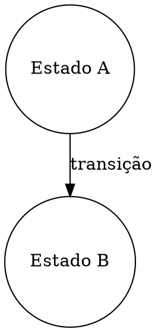
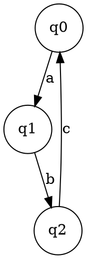

# 06 — Representação Gráfica em Compiladores

## 📚 Índice

1. [Introdução e Objetivos](#introdução-e-objetivos)
2. [Fundamentos Teóricos](#fundamentos-teóricos)
3. [Formato DOT e Graphviz](#formato-dot-e-graphviz)
4. [Visualização de Autômatos Finitos](#visualização-de-autômatos-finitos)
5. [Árvores de Sintaxe Abstrata (AST)](#árvores-de-sintaxe-abstrata-ast)
6. [Grafos de Fluxo de Controle (CFG)](#grafos-de-fluxo-de-controle-cfg)
7. [Grafos de Dependência de Dados (DDG)](#grafos-de-dependência-de-dados-ddg)
8. [Grafos de Dependência de Programa (PDG)](#grafos-de-dependência-de-programa-pdg)
9. [Forma Estática de Atribuição Única (SSA)](#forma-estática-de-atribuição-única-ssa)
10. [Exemplos Práticos em C](#exemplos-práticos-em-c)
11. [Exercícios Acadêmicos](#exercícios-acadêmicos)
12. [Referências e Leitura Adicional](#referências-e-leitura-adicional)

---

## Introdução e Objetivos

### 🎯 Objetivos de Aprendizagem

- **Compreender** a importância das representações gráficas no desenvolvimento de compiladores
- **Dominar** o formato DOT para geração de visualizações
- **Visualizar** autômatos, árvores de sintaxe e grafos de dependência
- **Implementar** geradores de representações gráficas em C
- **Analisar** código através de suas representações gráficas
- **Aplicar** técnicas de visualização para depuração e otimização

### 🔗 Por Que Representações Gráficas São Importantes?

As representações gráficas desempenham um papel crucial no desenvolvimento e compreensão de compiladores:

1. **Depuração Visual**: Facilita identificação de erros em análise léxica, sintática e semântica
2. **Otimização**: Permite visualizar oportunidades de otimização de código
3. **Educação**: Ajuda estudantes a compreender conceitos abstratos de compilação
4. **Documentação**: Fornece representações claras da estrutura e fluxo do programa
5. **Análise de Complexidade**: Permite avaliar visualmente a complexidade do código

---

## Fundamentos Teóricos

### 🧠 Teoria dos Grafos em Compiladores

Um **grafo** G = (V, E) consiste em:
- **V**: conjunto de vértices (nós)
- **E**: conjunto de arestas (conexões entre nós)

Em compiladores, usamos grafos para representar:

1. **Autômatos Finitos**: Estados como nós, transições como arestas
2. **Árvores de Derivação**: Símbolos gramaticais como nós, produções como arestas
3. **Grafos de Fluxo**: Blocos básicos como nós, saltos como arestas
4. **Grafos de Dependência**: Instruções como nós, dependências como arestas

### 📊 Tipos de Grafos em Compiladores

#### Grafos Dirigidos
- **Definição**: Arestas têm direção (A → B)
- **Uso**: CFG, DDG, PDG
- **Propriedade**: Podem conter ciclos (loops)

#### Árvores
- **Definição**: Grafo acíclico conexo com raiz
- **Uso**: AST, árvores de derivação
- **Propriedade**: Exatamente um caminho entre quaisquer dois nós

#### Grafos Acíclicos Dirigidos (DAG)
- **Definição**: Grafo dirigido sem ciclos
- **Uso**: Representação de expressões, SSA
- **Propriedade**: Permite compartilhamento de subexpressões

---

## Formato DOT e Graphviz

### 📝 O Que é DOT?

**DOT** é uma linguagem de descrição de grafos desenvolvida pela AT&T. É processada pela ferramenta **Graphviz** para gerar visualizações.

### Sintaxe Básica


```dot
digraph NomeDoGrafo {
    // Configurações globais
    rankdir=TB;  // Direção: Top to Bottom
    node [shape=circle];
    
    // Declaração de nós
    A [label="Estado A"];
    B [label="Estado B"];
    
    // Declaração de arestas
    A -> B [label="transição"];
}
```

### Atributos Comuns

#### Atributos de Nós
- `shape`: circle, box, diamond, ellipse, record
- `label`: texto exibido no nó
- `color`: cor da borda
- `fillcolor`: cor de preenchimento
- `style`: filled, dashed, bold

#### Atributos de Arestas
- `label`: texto na aresta
- `color`: cor da linha
- `style`: solid, dashed, dotted, bold
- `arrowhead`: normal, vee, diamond, none

### Exemplo Completo em C: Gerador de DOT

```c
#include <stdio.h>
#include <stdlib.h>

// Estrutura para representar um nó de grafo
typedef struct Node {
    int id;
    char *label;
    struct Node *next;
} Node;

// Estrutura para representar uma aresta
typedef struct Edge {
    int from;
    int to;
    char *label;
    struct Edge *next;
} Edge;

// Estrutura para representar um grafo
typedef struct Graph {
    Node *nodes;
    Edge *edges;
    char *name;
} Graph;

// Inicializa um grafo
Graph* createGraph(char *name) {
    Graph *g = (Graph*)malloc(sizeof(Graph));
    g->name = name;
    g->nodes = NULL;
    g->edges = NULL;
    return g;
}

// Adiciona um nó ao grafo
void addNode(Graph *g, int id, char *label) {
    Node *n = (Node*)malloc(sizeof(Node));
    n->id = id;
    n->label = label;
    n->next = g->nodes;
    g->nodes = n;
}

// Adiciona uma aresta ao grafo
void addEdge(Graph *g, int from, int to, char *label) {
    Edge *e = (Edge*)malloc(sizeof(Edge));
    e->from = from;
    e->to = to;
    e->label = label;
    e->next = g->edges;
    g->edges = e;
}

// Gera código DOT para o grafo
void generateDOT(Graph *g, FILE *output) {
    fprintf(output, "digraph %s {\n", g->name);
    fprintf(output, "    rankdir=TB;\n");
    fprintf(output, "    node [shape=circle];\n\n");
    
    // Escreve nós
    fprintf(output, "    // Nós\n");
    Node *n = g->nodes;
    while (n != NULL) {
        fprintf(output, "    %d [label=\"%s\"];\n", n->id, n->label);
        n = n->next;
    }
    
    // Escreve arestas
    fprintf(output, "\n    // Arestas\n");
    Edge *e = g->edges;
    while (e != NULL) {
        if (e->label != NULL) {
            fprintf(output, "    %d -> %d [label=\"%s\"];\n", 
                    e->from, e->to, e->label);
        } else {
            fprintf(output, "    %d -> %d;\n", e->from, e->to);
        }
        e = e->next;
    }
    
    fprintf(output, "}\n");
}

// Exemplo de uso
int main() {
    Graph *g = createGraph("ExemploAutomato");
    
    // Adiciona estados
    addNode(g, 0, "q0");
    addNode(g, 1, "q1");
    addNode(g, 2, "q2");
    
    // Adiciona transições
    addEdge(g, 0, 1, "a");
    addEdge(g, 1, 2, "b");
    addEdge(g, 2, 0, "c");
    
    // Gera DOT para stdout
    generateDOT(g, stdout);
    
    return 0;
}
```

**Saída esperada:**

```dot
digraph ExemploAutomato {
    rankdir=TB;
    node [shape=circle];

    // Nós
    0 [label="q0"];
    1 [label="q1"];
    2 [label="q2"];

    // Arestas
    0 -> 1 [label="a"];
    1 -> 2 [label="b"];
    2 -> 0 [label="c"];
}
```

---

## Visualização de Autômatos Finitos

### 🤖 Autômatos Finitos Determinísticos (AFD)

Um **AFD** M = (Q, Σ, δ, q₀, F) onde:
- **Q**: conjunto finito de estados
- **Σ**: alfabeto de entrada
- **δ**: função de transição Q × Σ → Q
- **q₀**: estado inicial
- **F**: conjunto de estados finais

### Representação Gráfica de AFD

```c
#include <stdio.h>
#include <stdlib.h>
#include <string.h>

#define MAX_STATES 100
#define MAX_TRANSITIONS 200

// Estrutura para representar uma transição
typedef struct {
    int from_state;
    int to_state;
    char symbol;
} Transition;

// Estrutura para representar um AFD
typedef struct {
    int num_states;
    int initial_state;
    int final_states[MAX_STATES];
    int num_final_states;
    Transition transitions[MAX_TRANSITIONS];
    int num_transitions;
} DFA;

// Gera visualização DOT para AFD
void generateDFA_DOT(DFA *dfa, FILE *output) {
    fprintf(output, "digraph AFD {\n");
    fprintf(output, "    rankdir=LR;\n");
    fprintf(output, "    node [shape=circle];\n");
    
    // Marca estado inicial
    fprintf(output, "    start [shape=point];\n");
    fprintf(output, "    start -> %d;\n", dfa->initial_state);
    
    // Marca estados finais com círculo duplo
    fprintf(output, "    node [shape=doublecircle];\n");
    for (int i = 0; i < dfa->num_final_states; i++) {
        fprintf(output, "    %d;\n", dfa->final_states[i]);
    }
    
    // Estados normais
    fprintf(output, "    node [shape=circle];\n\n");
    
    // Gera transições
    for (int i = 0; i < dfa->num_transitions; i++) {
        fprintf(output, "    %d -> %d [label=\"%c\"];\n",
                dfa->transitions[i].from_state,
                dfa->transitions[i].to_state,
                dfa->transitions[i].symbol);
    }
    
    fprintf(output, "}\n");
}

// Exemplo: AFD que aceita strings terminadas em "01"
int main() {
    DFA dfa;
    dfa.num_states = 3;
    dfa.initial_state = 0;
    dfa.final_states[0] = 2;
    dfa.num_final_states = 1;
    
    // Estado 0: lê 0 ou 1
    dfa.transitions[0] = (Transition){0, 0, '1'};
    dfa.transitions[1] = (Transition){0, 1, '0'};
    
    // Estado 1: leu 0
    dfa.transitions[2] = (Transition){1, 2, '1'};
    dfa.transitions[3] = (Transition){1, 1, '0'};
    
    // Estado 2: leu 01 (final)
    dfa.transitions[4] = (Transition){2, 0, '1'};
    dfa.transitions[5] = (Transition){2, 1, '0'};
    
    dfa.num_transitions = 6;
    
    FILE *f = fopen("afd_exemplo.dot", "w");
    generateDFA_DOT(&dfa, f);
    fclose(f);
    
    printf("Arquivo DOT gerado: afd_exemplo.dot\n");
    printf("Execute: dot -Tpng afd_exemplo.dot -o afd_exemplo.png\n");
    
    return 0;
}
```

### 🔄 Autômatos Finitos Não-Determinísticos (AFN)

**AFN** permite:
- Múltiplas transições para o mesmo símbolo
- Transições ε (vazias)

```c
// Estrutura para AFN com transições múltiplas
typedef struct {
    int from_state;
    int to_states[10];  // Múltiplos destinos possíveis
    int num_to_states;
    char symbol;  // '' para epsilon
} NFATransition;

void generateNFA_DOT(NFATransition *trans, int num_trans, FILE *output) {
    fprintf(output, "digraph AFN {\n");
    fprintf(output, "    rankdir=LR;\n");
    
    for (int i = 0; i < num_trans; i++) {
        for (int j = 0; j < trans[i].num_to_states; j++) {
            if (trans[i].symbol == '\0') {
                fprintf(output, "    %d -> %d [label=\"ε\"];\n",
                        trans[i].from_state, trans[i].to_states[j]);
            } else {
                fprintf(output, "    %d -> %d [label=\"%c\"];\n",
                        trans[i].from_state, trans[i].to_states[j],
                        trans[i].symbol);
            }
        }
    }
    
    fprintf(output, "}\n");
}
```

---

## Árvores de Sintaxe Abstrata (AST)

### 🌳 Fundamentos de AST

Uma **AST (Abstract Syntax Tree)** é uma representação em árvore da estrutura sintática de código fonte. Diferente da árvore de derivação, a AST:
- Omite detalhes sintáticos irrelevantes (parênteses, ponto-e-vírgula)
- Foca na estrutura semântica do programa
- É mais compacta e eficiente

### Estrutura de Nós de AST

```c
#include <stdio.h>
#include <stdlib.h>
#include <string.h>

// Tipos de nós da AST
typedef enum {
    NODE_NUMBER,
    NODE_VARIABLE,
    NODE_BINARY_OP,
    NODE_UNARY_OP,
    NODE_ASSIGN,
    NODE_IF,
    NODE_WHILE,
    NODE_BLOCK
} NodeType;

// Estrutura de nó da AST
typedef struct ASTNode {
    NodeType type;
    union {
        int number;           // Para NODE_NUMBER
        char *variable;       // Para NODE_VARIABLE
        struct {
            char op;          // +, -, *, /
            struct ASTNode *left;
            struct ASTNode *right;
        } binary;
        struct {
            char op;          // -, !
            struct ASTNode *operand;
        } unary;
        struct {
            char *var;
            struct ASTNode *value;
        } assign;
        struct {
            struct ASTNode *condition;
            struct ASTNode *then_branch;
            struct ASTNode *else_branch;
        } if_stmt;
        struct {
            struct ASTNode *condition;
            struct ASTNode *body;
        } while_stmt;
        struct {
            struct ASTNode **statements;
            int count;
        } block;
    } data;
} ASTNode;

// Cria nó de número
ASTNode* createNumberNode(int value) {
    ASTNode *node = (ASTNode*)malloc(sizeof(ASTNode));
    node->type = NODE_NUMBER;
    node->data.number = value;
    return node;
}

// Cria nó de operação binária
ASTNode* createBinaryOpNode(char op, ASTNode *left, ASTNode *right) {
    ASTNode *node = (ASTNode*)malloc(sizeof(ASTNode));
    node->type = NODE_BINARY_OP;
    node->data.binary.op = op;
    node->data.binary.left = left;
    node->data.binary.right = right;
    return node;
}

// Cria nó de variável
ASTNode* createVariableNode(char *name) {
    ASTNode *node = (ASTNode*)malloc(sizeof(ASTNode));
    node->type = NODE_VARIABLE;
    node->data.variable = strdup(name);
    return node;
}

// Gera DOT para AST
void generateAST_DOT_helper(ASTNode *node, int *counter, FILE *output) {
    if (node == NULL) return;
    
    int current_id = (*counter)++;
    
    switch (node->type) {
        case NODE_NUMBER:
            fprintf(output, "    node%d [label=\"%d\", shape=box];\n",
                    current_id, node->data.number);
            break;
            
        case NODE_VARIABLE:
            fprintf(output, "    node%d [label=\"%s\", shape=ellipse];\n",
                    current_id, node->data.variable);
            break;
            
        case NODE_BINARY_OP: {
            fprintf(output, "    node%d [label=\"%c\", shape=circle];\n",
                    current_id, node->data.binary.op);
            
            int left_id = *counter;
            generateAST_DOT_helper(node->data.binary.left, counter, output);
            fprintf(output, "    node%d -> node%d [label=\"left\"];\n",
                    current_id, left_id);
            
            int right_id = *counter;
            generateAST_DOT_helper(node->data.binary.right, counter, output);
            fprintf(output, "    node%d -> node%d [label=\"right\"];\n",
                    current_id, right_id);
            break;
        }
        
        case NODE_ASSIGN: {
            fprintf(output, "    node%d [label=\"="\", shape=diamond];\n",
                    current_id);
            
            int var_id = *counter;
            fprintf(output, "    node%d [label=\"%s\", shape=ellipse];\n",
                    var_id, node->data.assign.var);
            (*counter)++;
            fprintf(output, "    node%d -> node%d [label=\"var\"];\n",
                    current_id, var_id);
            
            int value_id = *counter;
            generateAST_DOT_helper(node->data.assign.value, counter, output);
            fprintf(output, "    node%d -> node%d [label=\"value\"];\n",
                    current_id, value_id);
            break;
        }
        
        default:
            fprintf(output, "    node%d [label=\"???\"];\n", current_id);
    }
}

void generateAST_DOT(ASTNode *root, FILE *output) {
    fprintf(output, "digraph AST {\n");
    fprintf(output, "    node [fontname=\"Arial\"];\n");
    fprintf(output, "    rankdir=TB;\n\n");
    
    int counter = 0;
    generateAST_DOT_helper(root, &counter, output);
    
    fprintf(output, "}\n");
}

// Exemplo: AST para "x = 3 + 4 * 5"
int main() {
    // Constrói AST: x = (3 + (4 * 5))
    ASTNode *mult = createBinaryOpNode('*',
                        createNumberNode(4),
                        createNumberNode(5));
    
    ASTNode *add = createBinaryOpNode('+',
                        createNumberNode(3),
                        mult);
    
    ASTNode *assign = (ASTNode*)malloc(sizeof(ASTNode));
    assign->type = NODE_ASSIGN;
    assign->data.assign.var = strdup("x");
    assign->data.assign.value = add;
    
    FILE *f = fopen("ast_exemplo.dot", "w");
    generateAST_DOT(assign, f);
    fclose(f);
    
    printf("AST gerada para: x = 3 + 4 * 5\n");
    printf("Execute: dot -Tpng ast_exemplo.dot -o ast_exemplo.png\n");
    
    return 0;
}
```

---

## Grafos de Fluxo de Controle (CFG)

### 🔀 Conceitos Fundamentais

Um **CFG (Control Flow Graph)** representa todos os caminhos possíveis de execução de um programa. Elementos principais:

- **Bloco Básico (BB)**: Sequência de instruções sem desvios internos
- **Aresta de Fluxo**: Transição entre blocos
- **Nó de Entrada**: Primeiro bloco executado
- **Nó de Saída**: Blocos de retorno/saída

### Identificação de Blocos Básicos

**Regras para início de bloco básico:**
1. Primeira instrução do programa
2. Alvo de um salto condicional ou incondicional
3. Instrução imediatamente após um salto

**Regras para fim de bloco básico:**
1. Instrução de salto (goto, if, while, return)
2. Instrução antes do alvo de um salto

### Exemplo em C: Gerador de CFG

```c
#include <stdio.h>
#include <stdlib.h>
#include <string.h>

#define MAX_BB 50
#define MAX_INSTRUCTIONS 10

// Estrutura para uma instrução
typedef struct {
    char code[100];
} Instruction;

// Estrutura para um bloco básico
typedef struct BasicBlock {
    int id;
    Instruction instructions[MAX_INSTRUCTIONS];
    int num_instructions;
    struct BasicBlock *successors[2];  // Máximo 2 sucessores
    int num_successors;
    char *label;
} BasicBlock;

// Estrutura para CFG
typedef struct {
    BasicBlock blocks[MAX_BB];
    int num_blocks;
    BasicBlock *entry;
} CFG;

// Cria novo bloco básico
BasicBlock* createBasicBlock(CFG *cfg, char *label) {
    int id = cfg->num_blocks++;
    BasicBlock *bb = &cfg->blocks[id];
    bb->id = id;
    bb->num_instructions = 0;
    bb->num_successors = 0;
    bb->label = label ? strdup(label) : NULL;
    return bb;
}

// Adiciona instrução a bloco básico
void addInstruction(BasicBlock *bb, char *code) {
    if (bb->num_instructions < MAX_INSTRUCTIONS) {
        strcpy(bb->instructions[bb->num_instructions++].code, code);
    }
}

// Adiciona aresta no CFG
void addEdge(BasicBlock *from, BasicBlock *to) {
    if (from->num_successors < 2) {
        from->successors[from->num_successors++] = to;
    }
}

// Gera DOT para CFG
void generateCFG_DOT(CFG *cfg, FILE *output) {
    fprintf(output, "digraph CFG {\n");
    fprintf(output, "    rankdir=TB;\n");
    fprintf(output, "    node [shape=record];\n\n");
    
    // Gera nós (blocos básicos)
    for (int i = 0; i < cfg->num_blocks; i++) {
        BasicBlock *bb = &cfg->blocks[i];
        fprintf(output, "    BB%d [label=\"{", bb->id);
        
        if (bb->label) {
            fprintf(output, "<%s>|", bb->label);
        } else {
            fprintf(output, "<BB%d>|", bb->id);
        }
        
        for (int j = 0; j < bb->num_instructions; j++) {
            fprintf(output, "%s", bb->instructions[j].code);
            if (j < bb->num_instructions - 1) {
                fprintf(output, "|");
            }
        }
        fprintf(output, "}\"];\n");
    }
    
    fprintf(output, "\n");
    
    // Gera arestas
    for (int i = 0; i < cfg->num_blocks; i++) {
        BasicBlock *bb = &cfg->blocks[i];
        for (int j = 0; j < bb->num_successors; j++) {
            if (j == 0 && bb->num_successors == 2) {
                fprintf(output, "    BB%d -> BB%d [label=\"true\"];\n",
                        bb->id, bb->successors[j]->id);
            } else if (j == 1) {
                fprintf(output, "    BB%d -> BB%d [label=\"false\"];\n",
                        bb->id, bb->successors[j]->id);
            } else {
                fprintf(output, "    BB%d -> BB%d;\n",
                        bb->id, bb->successors[j]->id);
            }
        }
    }
    
    fprintf(output, "}\n");
}

// Exemplo: CFG para código com if-else
int main() {
    CFG cfg;
    cfg.num_blocks = 0;
    
    // BB1: Entrada e inicialização
    BasicBlock *bb1 = createBasicBlock(&cfg, "ENTRY");
    addInstruction(bb1, "x = 5");
    addInstruction(bb1, "y = 10");
    
    // BB2: Condição
    BasicBlock *bb2 = createBasicBlock(&cfg, "COND");
    addInstruction(bb2, "if (x < y)");
    
    // BB3: Ramo then
    BasicBlock *bb3 = createBasicBlock(&cfg, "THEN");
    addInstruction(bb3, "z = x + y");
    
    // BB4: Ramo else
    BasicBlock *bb4 = createBasicBlock(&cfg, "ELSE");
    addInstruction(bb4, "z = x - y");
    
    // BB5: Junção
    BasicBlock *bb5 = createBasicBlock(&cfg, "EXIT");
    addInstruction(bb5, "return z");
    
    // Conecta blocos
    addEdge(bb1, bb2);
    addEdge(bb2, bb3);  // true branch
    addEdge(bb2, bb4);  // false branch
    addEdge(bb3, bb5);
    addEdge(bb4, bb5);
    
    cfg.entry = bb1;
    
    FILE *f = fopen("cfg_exemplo.dot", "w");
    generateCFG_DOT(&cfg, f);
    fclose(f);
    
    printf("CFG gerado com sucesso!\n");
    printf("Execute: dot -Tpng cfg_exemplo.dot -o cfg_exemplo.png\n");
    
    return 0;
}
```

### CFG para Loops

```c
// Exemplo: CFG para loop while
void generateWhileLoopCFG() {
    CFG cfg;
    cfg.num_blocks = 0;
    
    // BB1: Inicialização
    BasicBlock *bb1 = createBasicBlock(&cfg, "INIT");
    addInstruction(bb1, "i = 0");
    addInstruction(bb1, "sum = 0");
    
    // BB2: Condição do loop
    BasicBlock *bb2 = createBasicBlock(&cfg, "LOOP_COND");
    addInstruction(bb2, "if (i < 10)");
    
    // BB3: Corpo do loop
    BasicBlock *bb3 = createBasicBlock(&cfg, "LOOP_BODY");
    addInstruction(bb3, "sum = sum + i");
    addInstruction(bb3, "i = i + 1");
    
    // BB4: Saída
    BasicBlock *bb4 = createBasicBlock(&cfg, "EXIT");
    addInstruction(bb4, "return sum");
    
    // Conecta: INIT -> COND
    addEdge(bb1, bb2);
    // COND -> BODY (true) e COND -> EXIT (false)
    addEdge(bb2, bb3);
    addEdge(bb2, bb4);
    // BODY -> COND (back edge)
    addEdge(bb3, bb2);
    
    FILE *f = fopen("cfg_while.dot", "w");
    generateCFG_DOT(&cfg, f);
    fclose(f);
    
    printf("CFG de loop gerado!\n");
}
```

---

## Grafos de Dependência de Dados (DDG)

### 📊 Conceitos de Dependência

**Dependência de dados** ocorre quando uma instrução usa o resultado de outra:

1. **Dependência RAW (Read After Write)**: Dependência verdadeira
   ```c
   x = a + b;  // S1
   y = x * 2;  // S2 depende de S1 (RAW)
   ```

2. **Dependência WAR (Write After Read)**: Anti-dependência
   ```c
   y = x * 2;  // S1
   x = a + b;  // S2 anti-depende de S1 (WAR)
   ```

3. **Dependência WAW (Write After Write)**: Dependência de saída
   ```c
   x = a + b;  // S1
   x = c + d;  // S2 depende de S1 (WAW)
   ```

### Implementação de DDG em C

```c
#include <stdio.h>
#include <stdlib.h>
#include <string.h>

#define MAX_VARS 50

// Tipos de dependência
typedef enum {
    DEP_RAW,  // Read After Write
    DEP_WAR,  // Write After Read
    DEP_WAW   // Write After Write
} DependenceType;

// Estrutura para uma instrução
typedef struct Instruction {
    int id;
    char *code;
    char *def_var;      // Variável definida (write)
    char *use_vars[10]; // Variáveis usadas (read)
    int num_uses;
} Instruction;

// Estrutura para dependência
typedef struct Dependence {
    int from_inst;
    int to_inst;
    DependenceType type;
    char *var;
    struct Dependence *next;
} Dependence;

// Estrutura para DDG
typedef struct {
    Instruction instructions[50];
    int num_instructions;
    Dependence *dependencies;
} DDG;

// Cria instrução
Instruction* addInstruction(DDG *ddg, char *code, char *def, 
                           char **uses, int num_uses) {
    int id = ddg->num_instructions++;
    Instruction *inst = &ddg->instructions[id];
    inst->id = id;
    inst->code = strdup(code);
    inst->def_var = def ? strdup(def) : NULL;
    inst->num_uses = num_uses;
    for (int i = 0; i < num_uses; i++) {
        inst->use_vars[i] = strdup(uses[i]);
    }
    return inst;
}

// Adiciona dependência
void addDependence(DDG *ddg, int from, int to, 
                   DependenceType type, char *var) {
    Dependence *dep = (Dependence*)malloc(sizeof(Dependence));
    dep->from_inst = from;
    dep->to_inst = to;
    dep->type = type;
    dep->var = strdup(var);
    dep->next = ddg->dependencies;
    ddg->dependencies = dep;
}

// Analisa dependências
void analyzeDependencies(DDG *ddg) {
    // Para cada instrução
    for (int i = 0; i < ddg->num_instructions; i++) {
        Instruction *curr = &ddg->instructions[i];
        
        // Para cada instrução anterior
        for (int j = 0; j < i; j++) {
            Instruction *prev = &ddg->instructions[j];
            
            // Verifica RAW: prev define, curr usa
            if (prev->def_var != NULL) {
                for (int k = 0; k < curr->num_uses; k++) {
                    if (strcmp(prev->def_var, curr->use_vars[k]) == 0) {
                        addDependence(ddg, j, i, DEP_RAW, prev->def_var);
                    }
                }
            }
            
            // Verifica WAR: prev usa, curr define
            if (curr->def_var != NULL) {
                for (int k = 0; k < prev->num_uses; k++) {
                    if (strcmp(prev->use_vars[k], curr->def_var) == 0) {
                        addDependence(ddg, j, i, DEP_WAR, curr->def_var);
                    }
                }
            }
            
            // Verifica WAW: ambos definem mesma variável
            if (prev->def_var != NULL && curr->def_var != NULL) {
                if (strcmp(prev->def_var, curr->def_var) == 0) {
                    addDependence(ddg, j, i, DEP_WAW, curr->def_var);
                }
            }
        }
    }
}

// Gera DOT para DDG
void generateDDG_DOT(DDG *ddg, FILE *output) {
    fprintf(output, "digraph DDG {\n");
    fprintf(output, "    rankdir=TB;\n");
    fprintf(output, "    node [shape=box];\n\n");
    
    // Nós (instruções)
    for (int i = 0; i < ddg->num_instructions; i++) {
        Instruction *inst = &ddg->instructions[i];
        fprintf(output, "    I%d [label=\"%d: %s\"];\n",
                inst->id, inst->id, inst->code);
    }
    
    fprintf(output, "\n");
    
    // Arestas (dependências)
    Dependence *dep = ddg->dependencies;
    while (dep != NULL) {
        char *color;
        char *label;
        
        switch (dep->type) {
            case DEP_RAW:
                color = "black";
                label = "RAW";
                break;
            case DEP_WAR:
                color = "blue";
                label = "WAR";
                break;
            case DEP_WAW:
                color = "red";
                label = "WAW";
                break;
        }
        
        fprintf(output, "    I%d -> I%d [label=\"%s(%s)\", color=%s];\n",
                dep->from_inst, dep->to_inst, label, dep->var, color);
        
        dep = dep->next;
    }
    
    fprintf(output, "}\n");
}

// Exemplo de uso
int main() {
    DDG ddg;
    ddg.num_instructions = 0;
    ddg.dependencies = NULL;
    
    // Código exemplo:
    // t1 = a + b
    // t2 = t1 - c
    // t3 = t1 * d
    // t1 = e + f
    
    char *uses1[] = {"a", "b"};
    addInstruction(&ddg, "t1 = a + b", "t1", uses1, 2);
    
    char *uses2[] = {"t1", "c"};
    addInstruction(&ddg, "t2 = t1 - c", "t2", uses2, 2);
    
    char *uses3[] = {"t1", "d"};
    addInstruction(&ddg, "t3 = t1 * d", "t3", uses3, 2);
    
    char *uses4[] = {"e", "f"};
    addInstruction(&ddg, "t1 = e + f", "t1", uses4, 2);
    
    // Analisa dependências
    analyzeDependencies(&ddg);
    
    FILE *f = fopen("ddg_exemplo.dot", "w");
    generateDDG_DOT(&ddg, f);
    fclose(f);
    
    printf("DDG gerado com sucesso!\n");
    printf("Execute: dot -Tpng ddg_exemplo.dot -o ddg_exemplo.png\n");
    
    return 0;
}
```

---

## Grafos de Dependência de Programa (PDG)

### 🔗 Integração de Controle e Dados

Um **PDG (Program Dependence Graph)** combina:
- **Dependências de dados** (DDG)
- **Dependências de controle** (CFG)

**Dependência de controle**: Uma instrução S2 depende de S1 em controle se S1 determina se S2 será executada.

```c
if (x > 0) {  // S1
    y = 5;    // S2 controle-depende de S1
}
```

### Implementação de PDG

```c
#include <stdio.h>
#include <stdlib.h>

// Tipos de dependência em PDG
typedef enum {
    PDG_DATA,      // Dependência de dados
    PDG_CONTROL    // Dependência de controle
} PDGEdgeType;

// Estrutura para aresta do PDG
typedef struct PDGEdge {
    int from;
    int to;
    PDGEdgeType type;
    char *label;
    struct PDGEdge *next;
} PDGEdge;

// Estrutura para nó do PDG
typedef struct {
    int id;
    char *code;
    int is_predicate;  // É um nó de decisão?
} PDGNode;

// Estrutura para PDG
typedef struct {
    PDGNode nodes[50];
    int num_nodes;
    PDGEdge *edges;
} PDG;

// Adiciona nó ao PDG
int addPDGNode(PDG *pdg, char *code, int is_predicate) {
    int id = pdg->num_nodes++;
    pdg->nodes[id].id = id;
    pdg->nodes[id].code = strdup(code);
    pdg->nodes[id].is_predicate = is_predicate;
    return id;
}

// Adiciona aresta ao PDG
void addPDGEdge(PDG *pdg, int from, int to, 
                PDGEdgeType type, char *label) {
    PDGEdge *edge = (PDGEdge*)malloc(sizeof(PDGEdge));
    edge->from = from;
    edge->to = to;
    edge->type = type;
    edge->label = label ? strdup(label) : NULL;
    edge->next = pdg->edges;
    pdg->edges = edge;
}

// Gera DOT para PDG
void generatePDG_DOT(PDG *pdg, FILE *output) {
    fprintf(output, "digraph PDG {\n");
    fprintf(output, "    rankdir=TB;\n\n");
    
    // Nós
    for (int i = 0; i < pdg->num_nodes; i++) {
        PDGNode *node = &pdg->nodes[i];
        if (node->is_predicate) {
            fprintf(output, "    N%d [label=\"%d: %s\", shape=diamond];\n",
                    node->id, node->id, node->code);
        } else {
            fprintf(output, "    N%d [label=\"%d: %s\", shape=box];\n",
                    node->id, node->id, node->code);
        }
    }
    
    fprintf(output, "\n");
    
    // Arestas
    PDGEdge *edge = pdg->edges;
    while (edge != NULL) {
        if (edge->type == PDG_DATA) {
            fprintf(output, "    N%d -> N%d [label=\"%s\", color=black];\n",
                    edge->from, edge->to, edge->label);
        } else {  // PDG_CONTROL
            fprintf(output, 
                    "    N%d -> N%d [label=\"%s\", color=red, style=dashed];\n",
                    edge->from, edge->to, edge->label);
        }
        edge = edge->next;
    }
    
    fprintf(output, "}\n");
}

// Exemplo: PDG para código com if
int main() {
    PDG pdg;
    pdg.num_nodes = 0;
    pdg.edges = NULL;
    
    // Código exemplo:
    // 1: x = input()
    // 2: if (x > 0)
    // 3:     y = x * 2
    // 4: else
    // 5:     y = -x
    // 6: z = y + 1
    
    int n1 = addPDGNode(&pdg, "x = input()", 0);
    int n2 = addPDGNode(&pdg, "if (x > 0)", 1);
    int n3 = addPDGNode(&pdg, "y = x * 2", 0);
    int n4 = addPDGNode(&pdg, "y = -x", 0);
    int n5 = addPDGNode(&pdg, "z = y + 1", 0);
    
    // Dependências de dados
    addPDGEdge(&pdg, n1, n2, PDG_DATA, "x");
    addPDGEdge(&pdg, n1, n3, PDG_DATA, "x");
    addPDGEdge(&pdg, n1, n4, PDG_DATA, "x");
    addPDGEdge(&pdg, n3, n5, PDG_DATA, "y");
    addPDGEdge(&pdg, n4, n5, PDG_DATA, "y");
    
    // Dependências de controle
    addPDGEdge(&pdg, n2, n3, PDG_CONTROL, "true");
    addPDGEdge(&pdg, n2, n4, PDG_CONTROL, "false");
    
    FILE *f = fopen("pdg_exemplo.dot", "w");
    generatePDG_DOT(&pdg, f);
    fclose(f);
    
    printf("PDG gerado com sucesso!\n");
    printf("Execute: dot -Tpng pdg_exemplo.dot -o pdg_exemplo.png\n");
    
    return 0;
}
```

---

## Forma Estática de Atribuição Única (SSA)

### 🔄 Fundamentos de SSA

**SSA (Static Single Assignment)** é uma forma intermediária onde:
- Cada variável é atribuída **exatamente uma vez**
- Novas versões da variável são criadas para cada atribuição
- Função **φ (phi)** une definições de diferentes caminhos

### Exemplo de Conversão para SSA

**Código original:**
```c
x = 5;
if (c) {
    x = x + 1;
} else {
    x = 3;
}
y = x * 2;
```

**Código em SSA:**
```c
x₁ = 5;
if (c) {
    x₂ = x₁ + 1;
} else {
    x₃ = 3;
}
x₄ = φ(x₂, x₃);  // Função phi
y₁ = x₄ * 2;
```

### Implementação de Gerador SSA em C

```c
#include <stdio.h>
#include <stdlib.h>
#include <string.h>

#define MAX_VARS 100

// Estrutura para rastrear versões de variáveis
typedef struct {
    char name[50];
    int version;
} VarVersion;

// Estrutura para mapeamento de variáveis
typedef struct {
    VarVersion vars[MAX_VARS];
    int count;
} VarMap;

// Inicializa mapeamento
void initVarMap(VarMap *map) {
    map->count = 0;
}

// Obtém versão atual de variável
int getVarVersion(VarMap *map, char *var) {
    for (int i = 0; i < map->count; i++) {
        if (strcmp(map->vars[i].name, var) == 0) {
            return map->vars[i].version;
        }
    }
    return -1;  // Variável não encontrada
}

// Define nova versão de variável
int setVarVersion(VarMap *map, char *var) {
    for (int i = 0; i < map->count; i++) {
        if (strcmp(map->vars[i].name, var) == 0) {
            return ++map->vars[i].version;
        }
    }
    // Nova variável
    strcpy(map->vars[map->count].name, var);
    map->vars[map->count].version = 1;
    return map->vars[map->count++].version;
}

// Estrutura para nó SSA
typedef struct SSANode {
    int id;
    char *code;
    int is_phi;
    char *var;
    int version;
    struct SSANode *operands[10];
    int num_operands;
    struct SSANode *next;
} SSANode;

// Cria nó SSA
SSANode* createSSANode(char *code, int is_phi) {
    static int id_counter = 0;
    SSANode *node = (SSANode*)malloc(sizeof(SSANode));
    node->id = id_counter++;
    node->code = strdup(code);
    node->is_phi = is_phi;
    node->num_operands = 0;
    node->next = NULL;
    return node;
}

// Gera visualização DOT para SSA
void generateSSA_DOT(SSANode *head, FILE *output) {
    fprintf(output, "digraph SSA {\n");
    fprintf(output, "    rankdir=TB;\n");
    fprintf(output, "    node [shape=record];\n\n");
    
    SSANode *node = head;
    while (node != NULL) {
        if (node->is_phi) {
            fprintf(output, "    N%d [label=\"{%s|φ}\", ", 
                    node->id, node->code);
            fprintf(output, "shape=ellipse, style=filled, fillcolor=lightblue];\n");
        } else {
            fprintf(output, "    N%d [label=\"%s\"];\n", 
                    node->id, node->code);
        }
        
        // Desenha dependências
        for (int i = 0; i < node->num_operands; i++) {
            fprintf(output, "    N%d -> N%d;\n",
                    node->operands[i]->id, node->id);
        }
        
        node = node->next;
    }
    
    fprintf(output, "}\n");
}

// Exemplo prático de SSA
int main() {
    // Simula código:
    // a = 5
    // b = a + 3
    // if (b > 0)
    //     a = a + 1
    // else
    //     a = b * 2
    // c = a + b
    
    SSANode *n1 = createSSANode("a₁ = 5", 0);
    SSANode *n2 = createSSANode("b₁ = a₁ + 3", 0);
    n2->operands[0] = n1;
    n2->num_operands = 1;
    
    SSANode *n3 = createSSANode("if (b₁ > 0)", 0);
    n3->operands[0] = n2;
    n3->num_operands = 1;
    
    SSANode *n4 = createSSANode("a₂ = a₁ + 1", 0);
    n4->operands[0] = n1;
    n4->num_operands = 1;
    
    SSANode *n5 = createSSANode("a₃ = b₁ * 2", 0);
    n5->operands[0] = n2;
    n5->num_operands = 1;
    
    SSANode *n6 = createSSANode("a₄ = φ(a₂, a₃)", 1);
    n6->operands[0] = n4;
    n6->operands[1] = n5;
    n6->num_operands = 2;
    
    SSANode *n7 = createSSANode("c₁ = a₄ + b₁", 0);
    n7->operands[0] = n6;
    n7->operands[1] = n2;
    n7->num_operands = 2;
    
    // Liga nós
    n1->next = n2;
    n2->next = n3;
    n3->next = n4;
    n4->next = n5;
    n5->next = n6;
    n6->next = n7;
    
    FILE *f = fopen("ssa_exemplo.dot", "w");
    generateSSA_DOT(n1, f);
    fclose(f);
    
    printf("SSA gerado com sucesso!\n");
    printf("Execute: dot -Tpng ssa_exemplo.dot -o ssa_exemplo.png\n");
    
    return 0;
}
```

### Benefícios da Forma SSA

1. **Simplifica análise de fluxo de dados**: Cada uso está ligado a uma única definição
2. **Facilita otimizações**: Propagação de constantes, eliminação de código morto
3. **Detecta redundâncias**: Sub-expressões comuns são facilmente identificadas
4. **Melhora alocação de registradores**: Interferências são mais claras

---

## Exemplos Práticos em C

### Exemplo Completo: Analisador com Geração de Múltiplas Representações

```c
#include <stdio.h>
#include <stdlib.h>
#include <string.h>

// Sistema completo de análise com geração de CFG, DDG e PDG

typedef struct {
    char source_code[1000];
    CFG cfg;
    DDG ddg;
    PDG pdg;
} CompilerAnalysis;

void analyzeProgram(CompilerAnalysis *analysis) {
    // 1. Parsing e construção de IR
    printf("Parsing código...\n");
    
    // 2. Construção do CFG
    printf("Construindo CFG...\n");
    FILE *cfg_file = fopen("output_cfg.dot", "w");
    generateCFG_DOT(&analysis->cfg, cfg_file);
    fclose(cfg_file);
    
    // 3. Análise de dependências (DDG)
    printf("Analisando dependências de dados...\n");
    analyzeDependencies(&analysis->ddg);
    FILE *ddg_file = fopen("output_ddg.dot", "w");
    generateDDG_DOT(&analysis->ddg, ddg_file);
    fclose(ddg_file);
    
    // 4. Construção do PDG
    printf("Construindo PDG...\n");
    FILE *pdg_file = fopen("output_pdg.dot", "w");
    generatePDG_DOT(&analysis->pdg, pdg_file);
    fclose(pdg_file);
    
    printf("\nArquivos gerados:\n");
    printf("  - output_cfg.dot\n");
    printf("  - output_ddg.dot\n");
    printf("  - output_pdg.dot\n");
    printf("\nConvert para imagens com:\n");
    printf("  dot -Tpng output_cfg.dot -o cfg.png\n");
    printf("  dot -Tpng output_ddg.dot -o ddg.png\n");
    printf("  dot -Tpng output_pdg.dot -o pdg.png\n");
}

int main() {
    CompilerAnalysis analysis;
    
    strcpy(analysis.source_code,
           "int main() {\n"
           "    int x = 5;\n"
           "    int y = 10;\n"
           "    if (x < y) {\n"
           "        int z = x + y;\n"
           "    }\n"
           "    return 0;\n"
           "}");
    
    analyzeProgram(&analysis);
    
    return 0;
}
```

---

## Exercícios Acadêmicos

### Exercícios Básicos

1. **Geração de DOT para AFD**
   - Implemente um AFD que reconhece identificadores (letra seguida de letras/dígitos)
   - Gere visualização DOT do autômato
   - Teste com entrada válida e inválida

2. **AST para Expressões Aritméticas**
   - Crie AST para: `(3 + 4) * (5 - 2)`
   - Implemente função de avaliação da AST
   - Gere visualização DOT

3. **CFG Simples**
   - Construa CFG para função com if-else-if
   - Identifique blocos básicos corretamente
   - Gere visualização DOT

### Exercícios Intermediários

4. **Análise de Dependências**
   - Dado código com 10 instruções, identifique todas dependências RAW, WAR, WAW
   - Construa DDG completo
   - Identifique oportunidades de paralelização

5. **Conversão para SSA**
   - Converta função com loops para forma SSA
   - Insira funções φ corretamente
   - Gere visualização

6. **PDG Completo**
   - Construa PDG para código com loops aninhados
   - Identifique dependências de dados e controle
   - Use para análise de slicing

### Exercícios Avançados

7. **Otimização Visual**
   - Implemente eliminação de sub-expressões comuns
   - Visualize código antes e depois com DDG
   - Meça ganho de desempenho

8. **Análise de Loops**
   - Identifique back edges em CFG
   - Encontre loops naturais
   - Classifique loops (while, for, do-while)

9. **Slicing de Programa**
   - Dado PDG e critério de slicing
   - Compute backward slice
   - Visualize fatias do programa

10. **Gerador Universal**
    - Implemente ferramenta que recebe código C
    - Gera automaticamente: CFG, DDG, PDG, SSA
    - Interface gráfica ou linha de comando

---

## Referências e Leitura Adicional

### 📚 Livros Fundamentais

1. **"Compilers: Principles, Techniques, and Tools"** - Aho, Lam, Sethi, Ullman
   - Capítulo 8: Code Generation
   - Capítulo 9: Optimization

2. **"Engineering a Compiler"** - Cooper & Torczon
   - Capítulo 5: Intermediate Representations
   - Capítulo 9: Data-Flow Analysis

3. **"Modern Compiler Implementation in C"** - Appel
   - Capítulo 7: Activation Records
   - Capítulo 17: Dataflow Analysis

### 🔗 Recursos Online

- **Graphviz Documentation**: https://graphviz.org/documentation/
- **DOT Language Guide**: https://graphviz.org/doc/info/lang.html
- **SSA Book**: http://ssabook.gforge.inria.fr/latest/

### 🛠️ Ferramentas

- **Graphviz**: Renderização de grafos DOT
- **dot**: Gerador de layout hierárquico
- **neato**: Layout baseado em spring model
- **fdp**: Layout para grafos não direcionados

### 📄 Artigos Acadêmicos

1. Cytron et al., "Efficiently Computing Static Single Assignment Form"
2. Ferrante et al., "The Program Dependence Graph and Its Use in Optimization"
3. Allen & Cocke, "A Program Data Flow Analysis Procedure"

---

## Apêndice: Compilação e Uso

### Compilando os Exemplos

```bash
# Compilar gerador de DOT para autômatos
gcc -o gen_dfa gerador_dfa.c
./gen_dfa > automato.dot
dot -Tpng automato.dot -o automato.png

# Compilar gerador de AST
gcc -o gen_ast gerador_ast.c
./gen_ast > ast.dot
dot -Tpng ast.dot -o ast.png

# Compilar gerador de CFG
gcc -o gen_cfg gerador_cfg.c
./gen_cfg > cfg.dot
dot -Tpng cfg.dot -o cfg.png
```

### Instalando Graphviz

**Ubuntu/Debian:**
```bash
sudo apt-get install graphviz
```

**MacOS:**
```bash
brew install graphviz
```

**Windows:**
Download do site oficial: https://graphviz.org/download/

---

**Implementações incluídas neste diretório:**
- `exemploSimples.c` - Exemplos básicos de CFG com estruturas de controle
- `exemploPDG.c` - Implementação de Program Dependence Graph
- `exemploSSA.c` - Conversão e visualização de forma SSA

**Nota**: Este material é parte do curso de Compiladores. Para dúvidas, consulte o professor ou monitores.
